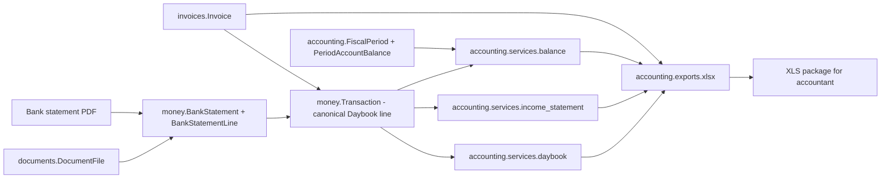
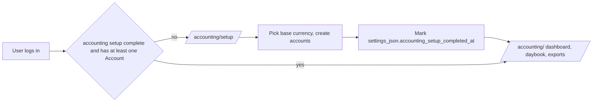

## Plan: Accounting MVP (Prima Nota → Daybook)

### Terminology (Italian → English)

- **Prima Nota** → **Daybook** (preferred). Established English accounting term for the exact same concept: an informal, chronological register of cash/bank movements. We will use "Daybook" in code and English UI; the Italian label "Prima Nota" can be shown when i18n support will be added to the project.
- *Spese / Entrate* → **Expenses / Income** (direction `in` / `out`).
- *Saldo iniziale / finale* → **Opening / Closing balance**.
- *Riconciliazione* → **Reconciliation** (Daybook ↔ Bank statement matching).
- *Bilancio mensile* → **Monthly close** (and per-period **Balance check**).

### Architecture overview

The single guiding rule: every euro that moved is exactly one `[money.Transaction](apps/money/models.py)`. Invoices, documents, and bank lines are *evidence* attached to those transactions.

### Per-app changes

#### [apps/money/](apps/money/) — generic money primitives + cash flow

Add core types so other apps stop hard-coding `DecimalField(... default='EUR')`.

New / replaced models in [apps/money/models.py](apps/money/models.py):

- `Currency` — ISO 4217 (`code`, `name`, `symbol`, `decimal_places`, `is_active`). Seeded with EUR/USD/GBP via a data migration.
- `ExchangeRate` — `from_currency`, `to_currency`, `rate (Decimal 18,8)`, `valid_from`, `source`. Lookup helper `ExchangeRate.get(from_, to_, on_date)`.
- `Account` — bank/cash register. Fields: `name`, `kind` (`bank` / `cash` / `other`), `iban`, `bank_name`, `currency` (FK), `opening_balance`, `opening_date`, `is_active`, `notes`.
- `TransactionCategory` — replaces existing `MoneyCategory`. Adds `kind` (`income` / `expense` / `transfer`) and a self-FK `parent` for one-level grouping.
- `Transaction` — *replaces* current `Transaction`. Single signed line representing one money movement. Key fields:
  - `date`, `direction` (`in`/`out`), `amount` (always positive), `currency` (FK).
  - `base_amount`, `exchange_rate` (snapshotted on save when `currency` ≠ tenant base).
  - `account` (FK Account), `category` (FK TransactionCategory, nullable).
  - `counterparty` (cached string), `description`, `reference`.
  - Optional links: `invoice` (`invoices.Invoice`), `customer` (`customers.Customer`), `vendor` (`vendors.Vendor`), `document` (`documents.DocumentFile`), `bank_statement_line` (FK below).
  - Indexes on `(account, date)` and `(date, direction)`.
- `BankStatement` — imported bank document. `account` (FK), `period_start`, `period_end`, `opening_balance`, `closing_balance`, `document` (FK DocumentFile), `parse_status`, `raw_text`.
- `BankStatementLine` — parsed lines. `statement` (FK), `date`, `direction`, `amount`, `description`, `bank_reference`, `matched_transaction` (FK Transaction, nullable), `is_matched`.

Helper / service modules:

- [apps/money/services/exchange.py](apps/money/services/exchange.py) — `convert(amount, from_, to_, on_date)` that prefers `ExchangeRate` and falls back to 1.0 with a warning log.
- [apps/money/services/bank_import.py](apps/money/services/bank_import.py) — orchestrates: `DocumentFile` → `documents.parsers.bank_statement` → `BankStatement` + lines.
- [apps/money/services/reconciliation.py](apps/money/services/reconciliation.py) — `auto_match_lines(statement)` matches a `BankStatementLine` to an existing `Transaction` by `(date ± N days, amount, account)` and links them; otherwise creates a draft `Transaction`.

#### [apps/documents/](apps/documents/) — base document layer + parsers (no accounting logic)

Keep current [apps/documents/models.py](apps/documents/models.py) (`DocumentFolder`, `DocumentFile`) and [apps/documents/ocr.py](apps/documents/ocr.py) and [apps/documents/parser.py](apps/documents/parser.py) as-is.

Refactor / add:

- `apps/documents/parsers/__init__.py` — base `BaseDocumentParser` class with a uniform interface (`parse(file_path) -> dict`).
- `apps/documents/parsers/invoice.py` — re-package the existing regex/LLM extraction for invoices behind the `BaseDocumentParser` API (logic stays here, the *application* of it stays in `invoices`).
- `apps/documents/parsers/bank_statement.py` — new. Regex-based parser for common Italian bank statement layouts (Intesa, UniCredit, etc.); returns `{opening_balance, closing_balance, lines: [...]}`. Fallback to LLM extraction (existing `apps/ai/`) when regex confidence is low. The accounting-specific *use* of these results lives in `money/services/bank_import.py`.

Reports specific to accounting will not live here — only the generic parsing of source documents.

#### [apps/invoices/](apps/invoices/) — keep the model, add accounting glue

Keep `Invoice`, `InvoiceExtraction`, `InvoiceTemplate` at [apps/invoices/models.py](apps/invoices/models.py) — no breaking changes.

Minimal additions for accounting:

- New properties on `Invoice`: `payments_total` (sum of linked `Transaction.amount`), `outstanding_amount` (`total_amount - payments_total`), `is_paid` (true when `outstanding_amount <= 0`); deprecate the existing `payment_date`-based `is_paid` to use payments instead.
- [apps/invoices/services.py](apps/invoices/services.py) — add `record_payment(invoice, *, account, date, amount, ...)` that creates a `money.Transaction` linked to the invoice.
- New [apps/invoices/resources.py](apps/invoices/resources.py) — `InvoiceResource(import_export.resources.ModelResource)` for XLS import/export of invoices (issued / received).

#### [apps/accounting/](apps/accounting/) — periods, reports, exports

Drop the experimental `JournalEntry` / `JournalEntryLine` from [apps/accounting/models.py](apps/accounting/models.py) (their migration is uncommitted, so this is clean).

New models:

- `FiscalPeriod` — one per `(year, month)`. `status` (`open` / `closed` / `locked`), `closed_at`, `closed_by` (User FK), `notes`. Periods are auto-created lazily when first accessed.
- `PeriodAccountBalance` — one per `(period, account)`. Fields:
  - `starting_balance` — what the bank/cash reported at the start of the period (defaults to previous period's `ending_balance`).
  - `ending_balance` — what the bank reports at the end of the period (entered by user from the bank statement).
  - `computed_flow` — auto sum of `Transaction.amount` (signed) in the period for that account.
  - `computed_ending` — auto `starting_balance + computed_flow`.
  - `discrepancy` — auto `ending_balance - computed_ending`.
  - `is_balanced` — auto `discrepancy == 0`.
  - `last_reconciled_at`.
- `AccountingExport` — audit log of generated XLS packages: `period`, `kind`, `file_path`, `generated_at`, `generated_by`, `parameters_json`.

Services in [apps/accounting/services/](apps/accounting/services/):

- `daybook.py` — `build_daybook(*, date_from, date_to, account=None) -> QuerySet[Transaction]` with `select_related('account','category','invoice','customer','vendor')`.
- `income_statement.py` — `build_income_statement(period) -> {income_by_category, expense_by_category, totals}`.
- `balance.py` — `recompute_period_balances(period)` that walks each `Account` and refreshes the `PeriodAccountBalance` row (computed fields + flag). Idempotent.
- `monthly_close.py` — `close_period(period, ending_balances_by_account, force=False)` validates every account is balanced (or `force=True`) and sets status to `closed`.
- `exports/xlsx.py` — uses `openpyxl` directly to build a styled multi-sheet workbook (see layout below). Returns an in-memory `BytesIO` for HTTP download and persists an `AccountingExport` record.
- `resources.py` — `TransactionResource`, `PeriodAccountBalanceResource` for django-import-export integration with Unfold admin.

Views / URLs in [apps/accounting/views.py](apps/accounting/views.py) + [apps/accounting/urls.py](apps/accounting/urls.py) (HTMX-friendly, `LoginRequiredMixin`):

- `GET /accounting/` — current month dashboard: status badge, balance cards per account with green check / red X, quick-export button.
- `GET /accounting/periods/` — list of periods with status.
- `GET /accounting/periods/<yyyy>-<mm>/` — period detail; tabs (HTMX): Daybook | Income & Expenses | Balance check | Exports.
- `GET /accounting/daybook/?from=&to=&account=&direction=&category=` — filterable Daybook table; HTMX-replace tbody on filter change.
- `POST /accounting/periods/<yyyy>-<mm>/balance/<account_id>/` — set reported `ending_balance`, triggers recompute.
- `POST /accounting/periods/<yyyy>-<mm>/close/` — close period.
- `GET /accounting/periods/<yyyy>-<mm>/export.xlsx` — download monthly accountant package.
- `POST /accounting/imports/bank-statement/` — upload bank PDF; runs `documents.parsers.bank_statement` + `money.services.bank_import` + `money.services.reconciliation.auto_match_lines`.

### XLS export — monthly accountant package

`accounting/services/exports/xlsx.py` builds one workbook per period, sheets in order:

- **Daybook** — `Date | Doc # | Counterparty | Description | Account | Category | In | Out | Balance (running)`.
- **Income & Expenses** — `Category | Income | Expenses | Net`, with totals row.
- **Balance** — per account: `Account | Opening | Total In | Total Out | Computed Closing | Reported Closing | Discrepancy | OK?` with conditional formatting (red on mismatch).
- **Issued Invoices** — `Date | # | Customer | Net | VAT | Gross | Status | Paid On | Doc`. Customers from customers app (<project-root>/apps/customers)
- **Received Invoices** — same, `Vendor` instead of `Customer`. Vendors from vendors app (<project-root>/apps/vendors)
- **Bank Statement Lines** (optional) — `Date | Description | Amount | Matched? | Linked Tx`.

Header row styling, frozen panes, currency-formatted numeric columns. `openpyxl` only — no third-party Excel layer beyond `django-import-export` (which uses `tablib` for ad-hoc admin export).

### Import flows

- **Invoice PDF**: existing pipeline (`documents.ocr` → `invoices.services` extraction → `Invoice`) is unchanged. Just plug the resulting `Invoice` into the daybook by recording a payment Transaction when (or if) the invoice is paid.
- **Bank statement PDF**: upload via [/accounting/imports/bank-statement/](apps/accounting/views.py); creates `BankStatement` + `BankStatementLine`s; auto-matches against existing `Transaction`s; unmatched lines surface in a reconciliation panel where the user clicks "Create transaction" (HTMX) to materialize them.
- **XLS import**: `django-import-export` Resources allow bulk-import of Transactions (manual data entry shortcut) and Invoices.

### Settings & dependencies

- Add to [requirements.txt](requirements.txt): `django-import-export`, `openpyxl`, `tablib[xlsx]`.
- Add `import_export` to `SHARED_APPS` (it's a generic admin tool) in [operational/settings.py](operational/settings.py). `unfold.contrib.import_export` is already listed.
- Set `IMPORT_EXPORT_USE_TRANSACTIONS = True`.
- Base currency per tenant: read from the existing [`Tenant.currency`](apps/tenants/models.py) field (default `"EUR"`); the setup wizard writes this. No global `BASE_CURRENCY` setting.

### Tenant setup wizard (gates accounting)

Decision: tenant provisioning stays exactly as-is in [apps/tenants/services/provisioning.py](apps/tenants/services/provisioning.py). Each tenant must complete a first-login wizard before they can use accounting features. The wizard is the single source of truth for tenant-specific configuration, and is reusable for future modules (organization profile, services keys, etc.).

- New app-level area, e.g. [apps/accounting/wizard/](apps/accounting/wizard/) (or a shared `apps/onboarding/` if other modules will plug in later — start in `accounting` to keep MVP scope tight).
- Steps (HTMX, one screen per step, progress indicator):
  1. **Organization profile** (optional in MVP) — confirm/edit the [`organizations.Organization`](apps/organizations/models.py) row already created at provisioning.
  2. **Base currency** — pick from active `money.Currency` rows (seeded by the per-tenant data migration). Writes [`Tenant.currency`](apps/tenants/models.py).
  3. **Accounts** — create at least one `money.Account` (kind `bank` and/or `cash`); fields: `name`, `kind`, `currency` (defaults to base), `iban`, `bank_name`, `opening_balance`, `opening_date`. User can add multiple before finishing.
  4. **Done** — mark setup complete.
- Completion flag: store on tenant, e.g. `Tenant.settings_json["accounting_setup_completed_at"]` (the `settings_json` field already exists). Avoids a new migration on the shared schema.
- Gating: a small mixin / decorator `accounting_setup_required` checks `request.tenant.settings_json` plus the existence of at least one active `money.Account`. If missing, redirect to `/accounting/setup/`. Apply to all `apps.accounting` views and to `money.services.bank_import` / `record_payment` entry points.
- URLs: `GET /accounting/setup/` (intro), `GET|POST /accounting/setup/<step>/` (one route per step), `POST /accounting/setup/complete/`.
- Idempotent: re-entering the wizard from the dashboard ("Settings" link) is supported and simply edits existing rows.

### Migrations strategy

All affected `0001_initial.py` migrations are uncommitted (in `git status`). Cleanest path:

1. Make the model edits in `money`, `accounting`, (small additions in) `invoices`, `documents`.
2. Delete the uncommitted `0001_initial.py` of: `apps/money/migrations/`, `apps/accounting/migrations/`, `apps/invoices/migrations/0001_initial.py` and `0002_initial.py`, `apps/documents/migrations/0001_initial.py`.
3. `python manage.py makemigrations` — produces fresh, coherent initials.
4. Add a per-tenant **data migration** in `apps/money/migrations/0002_seed_currencies.py` that creates the EUR/USD/GBP `Currency` rows (idempotent `get_or_create`). Because `apps.money` is a `TENANT_APP`, this runs automatically for every existing and future tenant on `migrate_schemas`, with no change to provisioning code.
5. `python manage.py migrate_schemas --shared` then `migrate_schemas` for tenants.
6. **No** data migration for `Account` and **no** changes to [apps/tenants/services/provisioning.py](apps/tenants/services/provisioning.py). Accounts are created by the tenant via the setup wizard described above.

### Out of scope (explicitly)

- Double-entry journal entries, full chart of accounts, libro giornale generation. The accountant produces those from our Daybook XLS.
- Italian VAT registers (registri IVA), libro inventari, registro beni ammortizzabili — handled by the accountant.
- Italian e-invoice (FatturaPA / SDI) integration.
- Multi-currency reporting beyond per-transaction snapshot of `base_amount`.
- Automated bank PSD2/Open Banking sync (only PDF import for now).
- AI-powered category prediction (categories are manual / rule-based for v1).

