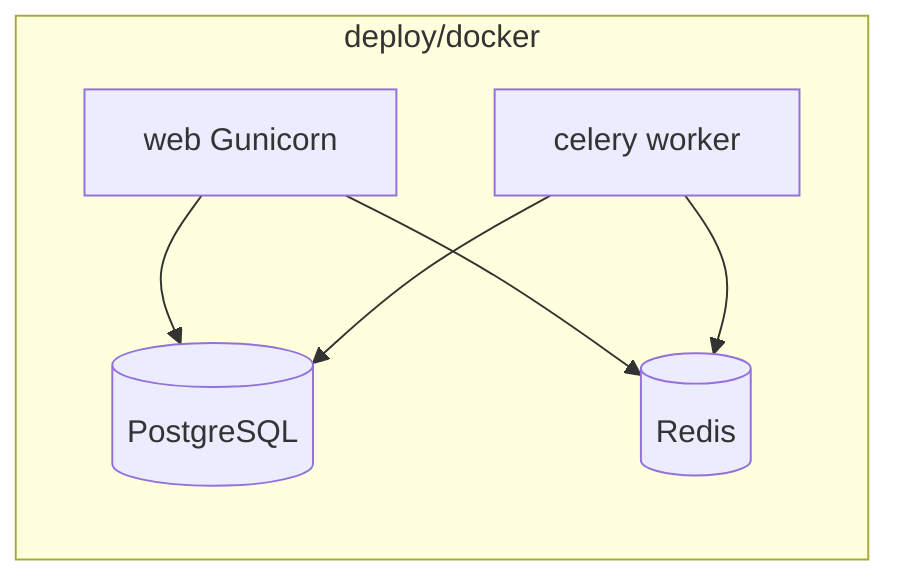

# Docker Compose deployment (./deploy/docker)

## Current state

- **Django 6.0** with [operational/settings.py](operational/settings.py): django-tenants, PostgreSQL (hardcoded `NAME=operational`, `USER=tobia`, `HOST=localhost`), no `STATIC_ROOT`, no Celery or Redis config.
- **No Celery** in codebase or [requirements.txt](requirements.txt); docs mention Celery as planned.
- **No** `./deploy` folder yet.
- **WSGI** entry: `operational.wsgi:application` ([operational/wsgi.py](operational/wsgi.py)).

## Architecture




- **PostgreSQL**: database for Django and django-tenants (single DB, multiple schemas).
- **Redis**: Celery broker and result backend (required for Celery).
- **web**: Django app via Gunicorn; runs migrations and collectstatic on startup (or via entrypoint).
- **celery**: Celery worker using same image and env.

## 1. Minimal Celery setup (required for worker)

Celery is not installed or configured. Add the minimum so the worker can start and pick up tasks later:

- **Dependencies**: Add `celery[redis]` and `gunicorn` to [requirements.txt](requirements.txt) (or add `deploy/docker/requirements.txt` that extends base; prefer one source of truth in root `requirements.txt`).
- **App**: Create `operational/celery.py` that builds a Celery app with `namespace='CELERY'`, sets `broker_url` and `result_backend` from env (e.g. `REDIS_URL`), and uses `django.conf.settings`.
- **Load Celery on Django startup**: In [operational/**init**.py](operational/__init__.py), add `from .celery import app as celery_app` and `__all__ = ['celery_app']` so the worker discovers the app.
- **Settings**: In [operational/settings.py](operational/settings.py), add optional env-based config, e.g. `CELERY_BROKER_URL = os.getenv('CELERY_BROKER_URL', '')` and `CELERY_RESULT_BACKEND` (same or empty); no need for a separate settings file if you use env vars.

No tasks need to be defined for the stack to run; you can add tasks later in apps.

## 2. Env-based settings for containers

In [operational/settings.py](operational/settings.py) (or a small `operational/settings_docker.py` that imports and overrides), ensure:

- **Database**: Read from env, e.g. `POSTGRES_HOST`, `POSTGRES_PORT`, `POSTGRES_DB`, `POSTGRES_USER`, `POSTGRES_PASSWORD`, and build `DATABASES['default']` (keep `ENGINE='django_tenants.postgresql_backend'`). Defaults can match current dev for local runs.
- **SECRET_KEY**: `os.getenv('SECRET_KEY', '...')` with a dev fallback; in Compose use env file or `environment`.
- **ALLOWED_HOSTS**: `os.getenv('ALLOWED_HOSTS', '').split()` or allow `*` in Docker only.
- **STATIC_ROOT**: Set to e.g. `BASE_DIR / 'staticfiles'` so `collectstatic` has a target (needed for serving via WhiteNoise or reverse proxy later).
- **DEBUG**: `os.getenv('DEBUG', 'False').lower() == 'true'`; Compose should set `DEBUG=False`.

This keeps a single settings module and avoids duplicating SHARED_APPS/TENANT_APPS.

## 3. `./deploy/docker` layout


| File                                     | Purpose                                                                                                                                                                                                                            |
| ---------------------------------------- | ---------------------------------------------------------------------------------------------------------------------------------------------------------------------------------------------------------------------------------- |
| `deploy/docker/docker-compose.yml`       | Define services: `db` (PostgreSQL), `redis`, `web` (Gunicorn), `celery` (worker).                                                                                                                                                  |
| `deploy/docker/Dockerfile`               | Multi-stage optional; base: Python image, install deps from repo root `requirements.txt`, set `WORKDIR` to project root, expose port (e.g. 8000), default CMD Gunicorn binding `0.0.0.0:8000` with `operational.wsgi:application`. |
| `deploy/docker/.env.example`             | Document `POSTGRES`_*, `REDIS_URL`/`CELERY_BROKER_URL`, `SECRET_KEY`, `ALLOWED_HOSTS`, `DEBUG`.                                                                                                                                    |
| `deploy/docker/entrypoint.sh` (optional) | Run `migrate`, `migrate_schemas`, `collectstatic --noinput`, then `exec "$@"` so the container runs migrations before Gunicorn/celery.                                                                                             |


**docker-compose.yml** (summary):

- **db**: `postgres:16` (or 15), env `POSTGRES_USER`, `POSTGRES_PASSWORD`, `POSTGRES_DB`; volume for data; healthcheck with `pg_isready`.
- **redis**: `redis:7-alpine`; optional healthcheck.
- **web**: build context `../../..` (repo root), Dockerfile `./deploy/docker/Dockerfile`; env from `.env` or `environment`; depends_on db (and redis if Django/Celery need it); ports `8000:8000`; command/entrypoint to run migrations then Gunicorn (e.g. `--workers 2 --bind 0.0.0.0:8000`).
- **celery**: same image as web; command `celery -A operational worker -l info`; depends_on db and redis; same env (so `CELERY_BROKER_URL=redis://redis:6379/0`).

Use **build context** at repo root so the Dockerfile can `COPY . .` and use `requirements.txt` and `operational/` from the project. Paths in the Dockerfile should assume `WORKDIR` is the project root (where `manage.py` lives).

**Dockerfile** (summary):

- `FROM python:3.12-slim` (or match your current Python).
- Install system deps for `psycopg2` if needed (`libpq-dev` or use `psycopg2-binary` in requirements).
- `COPY requirements.txt .` then `pip install -r requirements.txt`.
- `COPY . .`
- `ENV PYTHONUNBUFFERED=1`
- Default `CMD` for web: run entrypoint if present, else `gunicorn operational.wsgi:application --bind 0.0.0.0:8000`.

**django-tenants**: In entrypoint (or a one-off job), run `python manage.py migrate` then `python manage.py migrate_schemas --shared` so public and tenant schemas exist. The deploy skill confirms this order.

## 4. Optional: Celery Beat

If you want scheduled tasks, add a **celery-beat** service: same image, command `celery -A operational beat -l info`, depends_on redis and db. One beat instance per environment.

## 5. Static files

Setting `STATIC_ROOT` and running `collectstatic` in the entrypoint is enough for the stack. Serving them in production can be handled later (e.g. WhiteNoise in the same container, or a reverse proxy/volume). The plan does not add WhiteNoise unless you want it inside this Compose setup.

## 6. What stays out of scope

- **Nginx/reverse proxy**: Not in this plan; you can put Nginx in front of `web` later.
- **HTTPS**: Handled by a proxy or load balancer; not inside this Compose.
- **Secrets**: Use `.env` (gitignored) and `.env.example`; no Docker secrets in the initial plan.

## File change summary


| Action           | Path                                                                                                            |
| ---------------- | --------------------------------------------------------------------------------------------------------------- |
| Add deps         | [requirements.txt](requirements.txt): `gunicorn`, `celery[redis]`                                               |
| Add Celery app   | New `operational/celery.py`                                                                                     |
| Load Celery      | [operational/**init**.py](operational/__init__.py): import `celery_app`                                         |
| Env-based config | [operational/settings.py](operational/settings.py): DB, SECRET_KEY, ALLOWED_HOSTS, STATIC_ROOT, DEBUG, CELERY_* |
| New              | `deploy/docker/docker-compose.yml`                                                                              |
| New              | `deploy/docker/Dockerfile`                                                                                      |
| New              | `deploy/docker/.env.example`                                                                                    |
| New              | `deploy/docker/entrypoint.sh` (optional but recommended for migrate + collectstatic)                            |


## Run after implementation

From repo root:

```bash
cd deploy/docker
cp .env.example .env   # edit .env with real values
docker compose up --build
```

Then open `http://localhost:8000`. Run `docker compose run --rm web python manage.py migrate_schemas` if you prefer migrations as a one-off instead of in entrypoint.