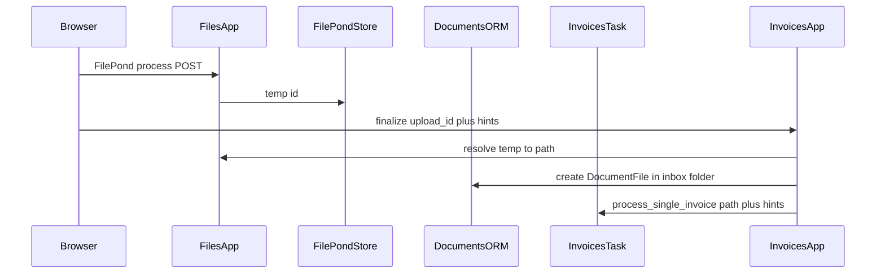

# File uploads (services), invoices, tenant company profile

## Context from the codebase

- `**[apps/documents/models.py](apps/documents/models.py)**` already has `DocumentFolder` and `DocumentFile` (folder scan, hashes, status). `**[apps/invoices/models.py](apps/invoices/models.py)**` links `Invoice.document_file` to `documents.DocumentFile` and has rich invoice + `**InvoiceExtraction**` (JSON, confidence, method).
- `**[apps/invoices/views.py](apps/invoices/views.py)**` already implements `invoice_upload`, `process_upload` (FilePond temp → `store_upload` → Celery `process_single_invoice`), and verification views, but `**django_drf_filepond` is not in `[requirements.txt](requirements.txt)**` and **invoice routes are not included** in `[operational/urls.py](operational/urls.py)`. Templates under `invoices/*.html` are **referenced but not present** in the repo snapshot (upload UI is incomplete).
- `**[apps/files/](apps/files/)`** is a stub (`models.py` empty, `**apps.files` is not in `TENANT_APPS`** in `[operational/settings.py](operational/settings.py)`). `[apps/files/apps.py](apps/files/apps.py)` uses `name = 'files'` — should be `**apps.files**` when registered.
- `**[apps/invoices/services.py](apps/invoices/services.py)**` imports `**CompanyInformation` from `apps.core.models**`, but `**CompanyInformation` does not exist** in `[apps/core/models.py](apps/core/models.py)` — this is a real inconsistency to fix as part of classification work.

**Your chosen architecture:** `apps/files` = **upload services only**; `**documents`** = folder scan + invoice ingestion/attachments; processing continues to center on `DocumentFile` / existing Celery task.

---

## 1. `apps/files` — upload services (not the canonical document row)

**Responsibilities**

- HTTP endpoints compatible with **FilePond** (`process`, `revert`, optional `patch`/`restore` if you adopt full django-drf-filepond patterns).
- After a successful process, **create or update** a `DocumentFile` in a configured inbox `DocumentFolder` (and return identifiers the client needs: e.g. `upload_id`, and later `document_file_id` once materialized).
- Thin **admin-facing** path: either a small admin action on `DocumentFile` / `DocumentFolder` (“upload PDF here”) or a dedicated `**files` admin ModelAdmin** that only creates a `DocumentFile` via `FileField` save — trivial and keeps “upload” discoverable without duplicating long-term storage logic.

**Concrete steps**

- Add `**apps.files`** to `**TENANT_APPS`** in `[operational/settings.py](operational/settings.py)`; fix `[apps/files/apps.py](apps/files/apps.py)` to `name = "apps.files"`.
- Add `[apps/files/urls.py](apps/files/urls.py)` and include from `[operational/urls.py](operational/urls.py)` (e.g. `path("files/", include("apps.files.urls"))`) **or** nest under an existing tenant UI prefix; keep CSRF-safe POSTs for FilePond.
- Add `**django-drf-filepond`** to `[requirements.txt](requirements.txt)` and wire its settings + `urlpatterns` per upstream docs (align with existing imports in `[apps/invoices/views.py](apps/invoices/views.py)`: `TemporaryUpload`, `store_upload`, `DJANGO_DRF_FILEPOND_FILE_STORE_PATH`).
- Move **generic FilePond process/revert** logic out of `invoices` into `**apps/files`** (views + small helpers), and have `**invoices.process_upload`** become a thin wrapper that:
  - delegates file handling to `files`,
  - passes **classification hints** (see §3) into `process_single_invoice.delay(...)`.

**Client (FilePond)**

- Add static assets (FilePond + minimal CSS) under e.g. `[static/vendor/filepond/](static/vendor/filepond/)` or npm-built bundle — project convention wins; expose on upload template.
- Implement `[templates/.../invoices/upload.html](templates/)` (missing today): FilePond `server.url` pointing at the `**files`** endpoints, CSRF header for SPA-style uploads, then POST to invoice “finalize” endpoint with `upload_id` + form hints (or single endpoint if you prefer).

---

## 2. `documents` — folder scan and invoice attachments (unchanged role)

- Keep `**DocumentFolder` / `DocumentFile**` as the **canonical persisted file** for scanned folders and uploaded PDFs.
- Ensure the **folder scan** command / watcher (`[apps/documents/management/commands/process_invoices.py](apps/documents/management/commands/process_invoices.py)` and related) continues to create `DocumentFile` rows; uploads from `files` should target the **same** inbox folder semantics so one pipeline processes both sources.
- The DocumentFolder scan is fine for local env, but on the server the document folder is not easily accessible to be used as a quick container for all the files. Instead make the DocumentFolder logic as an automatic phase of the bulk or zip upload, so when the users want to upload a zip containing all the month's files for the daybook, they're stored in a separate folder and this is then scanned to process each doc in it, like said before.

---

## 3. Invoices — optional fields for classification + UX

**Naming (“direction”)**

- Prefer **received / emitted** (already in `[Invoice.INVOICE_TYPE_CHOICES](apps/invoices/models.py)`) in the API/model; in the UI label them **Received / Emitted** as the choice field says (clearer for non-accountants). Avoid ambiguous “in/out” in stored enums.

**Fields you listed vs what already exists**

| Intent                                  | Already on `Invoice` / `InvoiceExtraction`                                                                                                         |
| --------------------------------------- | -------------------------------------------------------------------------------------------------------------------------------------------------- |
| Direction                               | `invoice_type` (`received` / `emitted`)                                                                                                            |
| Invoice date / payment date             | `invoice_date`, `payment_date`                                                                                                                     |
| Paid                                    | `is_paid` property (from payments + legacy `payment_date`); consider an explicit `**paid**` boolean only if you need user override vs ledger truth |
| Payment method                          | `payment_method` FK                                                                                                                                |
| Vendor / customer                       | `vendor`, `customer` — UI already branches in `[invoice_verify](apps/invoices/views.py)`                                                           |
| Amount / VAT                            | `total_amount`, `vat_percentage`, `vat_amount`, `taxable_amount`, `currency`                                                                       |
| Extraction / confidence / manual review | `InvoiceExtraction.confidence_score`, `raw_extracted_data`, `Invoice.needs_manual_review`, `status`                                                |

**Add for “upload-time hints” (pre-LLM, optional)**

- New `**JSONField**` on `Invoice` (e.g. `classification_hints`) **or** a small related model `InvoiceImportHint` (one row per upload) storing: suggested `invoice_type`, optional `vendor_id` / `customer_id`, notes, “expected currency”, etc. JSON on `Invoice` is faster to ship; a related model is cleaner if you want multiple import attempts per invoice.

**Important fields to add (suggested)**

- **Document kind**: `invoice` / `credit_note` / `proforma` / `other` (credit notes flip signs and workflows) as CHOICES.
- **Invoice number** already exists; add **supplier/customer VAT ID** at invoice level if not always resolved to Vendor/Customer rows.
- **Due date** already exists.
- **Purchase order reference**, **payment reference** (structured remittance), **IBAN/BIC** (when not covered by `PaymentMethod`).
- **Line items** as JSON (optional) for accounting and VAT split by line.
- **Source metadata**: original upload user, original `DocumentFile` id, **file hash** (duplicate detection — already on `DocumentFile`).

**Paid flag**

- Prefer deriving from `**money.Transaction**` links (already in model design) and treat `**payment_date**` as legacy; if users need “marked paid without transaction”, add explicit `paid_override` or use `**notes**` until money module catches up.
- extract payment info from invoice to automatically create a Transaction record to associate with the invoice. if payment info is completely missing, use the paid flag as trigger to create such Transaction, with the same dates as the invoice and using the default account and method. (we might need to add is_default field to both models)

---

## 4. Tenant company profile — `**apps.tenants` vs `apps.core**`

**Decision: primary profile in `apps.tenants` (public / `Tenant` row).**

- Classification is **organization-level**, shared by all users in the tenant. `core` should stay generic (`BaseModel`, admin mixins), not own billing/legal identity.
- Implement `**TenantCompanyProfile**` as `**OneToOneField**` to `[Tenant](apps/tenants/models.py)` (same DB as tenant registry) with e.g. `legal_name`, `trading_name`, `vat_id`, `tax_code`, registered address fields, `**trading_aliases` JSON** (list of strings), default `**currency**` (can mirror `Tenant.currency` or deprecate duplicate), optional `**email` / `phone` / website`**, **`logo`** if you want UI later.
- **Migration** on shared schema only (standard for `Tenant`).

**Integrate with invoice code**

- Replace `**get_user_company_info(user)`** with `**get_tenant_company_info(tenant)`** (and pass `tenant` from Celery via `schema_name` → resolve `Tenant` in public schema, or pass `tenant_id` explicitly). Remove or repurpose the dead `**CompanyInformation**` import in `[apps/invoices/services.py](apps/invoices/services.py)`.
- Keep optional **user-specific overrides** out of scope unless you later need “upload on behalf of subsidiary” — then add a tenant-scoped `Organization` model in tenant schema, not `core`.

---

## 5. PDF + local LLM extraction — suggested requirements

- **Structured output**: LLM returns JSON matching a **strict schema** (Pydantic / `jsonschema`); reject or repair invalid JSON before ORM write.
- **Per-field confidence** + **overall confidence**; store raw JSON in `InvoiceExtraction.raw_extracted_data` and normalized copy in `validated_data`.
- **Provenance**: for each important field, store **page number + snippet** (or bbox if OCR gives it) in JSON for audit and dispute resolution.
- **Deterministic validation layer**: recompute totals from line items when present; check **net + VAT ≈ gross** within rounding; flag `needs_manual_review` on mismatch.
- **Currency rules**: normalize ISO 4217; if multi-currency, require explicit `currency` and optional `exchange_rate` / `converted_amount` (fields already exist on `Invoice`).
- **Direction logic**: use `**TenantCompanyProfile`** (names, VAT, aliases) + fuzzy match (`[identify_issuer_receiver](apps/invoices/services.py)`) to set `invoice_type` and vendor/customer assignment; record reasoning in extraction JSON.
- **Model provenance**: store `**model_name`**, `**prompt_version`**, `**extraction_method**` (already on `InvoiceExtraction`) for reproducibility.
- **Safety / ops**: max upload size, allowed MIME (`application/pdf`), timeouts, Celery retries (already in task), **PII logging policy** (never log full PDF text in production logs).
- **Human-in-the-loop**: thresholds (e.g. overall confidence < 0.75 or validation fail) → `status='review'`, `needs_manual_review=True` (already aligned with model).

**Tooling**

- Continue **pdf text/layout** via existing `[pdfplumber](apps/invoices/tasks.py)` + `[OCRProcessor](apps/documents/ocr.py)`; LLM call via existing stack (**langchain + ollama** in requirements) with a single service module (one function per file per project convention).

---

## 6. Missing product features (worth tracking)

- **URL wiring**: mount `[apps/invoices/urls.py](apps/invoices/urls.py)` under e.g. `path("invoices/", include("apps.invoices.urls"))` so upload/verify/API are reachable.
- **Permissions**: tenant-safe queryset rules for any new `files` endpoints (mirror `[TenantSafeQuerysetMixin](apps/core/tenant.py)` patterns).
- **Duplicate handling**: use `DocumentFile.file_hash` to short-circuit or warn.
- **Virus/malware scan** (ClamAV or cloud) before processing — defer unless compliance requires.
- **Retention**: align with `Tenant.data_retention_days` for stored PDFs and extraction blobs.

---

## Implementation order (suggested)

1. Fix **tenant company profile** model + migration; refactor `**get_user_company_info` → tenant-based** helper used by `[apps/invoices/tasks.py](apps/invoices/tasks.py)`.
2. Register `**apps.files`**, add **django-drf-filepond** + settings + URLs; implement **FilePond service views** and move temp-store logic out of invoices.
3. **Wire root URLs** for invoices; add **upload template + static FilePond**; connect finalize flow to `**DocumentFile` + `process_single_invoice`** with **hints payload**.
4. Add `**classification_hints`** (or related model) + pass hints into Celery; extend verify template if new hint fields should be editable post-extraction.
5. **Admin**: minimal `DocumentFile` upload path or small `files` admin to trigger same service as browser.
6. Add the bulk docs upload feature (for daybooks) that creates the folder with docs to be scanned in bulk.

