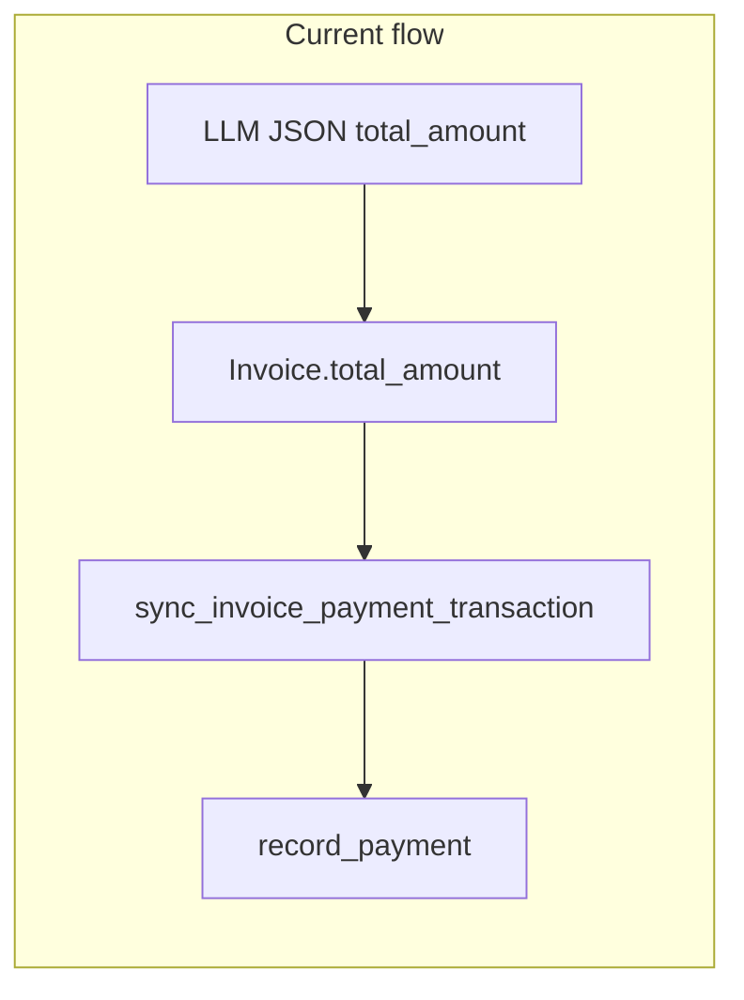

# Invoice total vs payments extraction

## What is going wrong

Today a single field drives both semantics:

- [`call_ollama_extraction`](apps/invoices/tasks.py) asks for `total_amount (numeric)` with **no definition** of whether that is the **charged invoice total**, the **amount due after payments**, or a **subtotal**.

- [`save_extracted_data`](apps/invoices/tasks.py) copies that straight into [`Invoice.total_amount`](apps/invoices/models.py) (`MinValueValidator(0)` — so 0 is valid).

- [`sync_invoice_payment_transaction`](apps/invoices/payment_transaction.py) does:

```55:61:apps/invoices/payment_transaction.py
    total = Invoice._coerce_decimal(invoice.total_amount)
    if total is None or total <= 0:
        return None
    if invoice.payments_total >= total:
        return None
    if not invoice.payment_date and not getattr(invoice, "paid_override", False):
        return None
```

If the model returns **0** because the PDF shows **Amount Due 0.00** (while Subtotal / Payments show 10 / -10), the function **returns immediately** and **no** `money.Transaction` is created, even when `paid_in_full` / `is_paid` is true.

Even if that guard were relaxed, [`record_payment`](apps/invoices/services.py) defaults `amount` to `invoice.outstanding_amount` (`total_amount - payments_total`). With `total_amount=0` and no allocations, outstanding is **0**, so payment creation would still fail the `payment_amount <= 0` check.

So the bug is not only “bad UX”; it is **inconsistent data + blocked automation** whenever the model picks “balance due” as `total_amount`.



## Recommended direction (prompt + normalization + sync)

### 1. Enrich the Ollama JSON schema (single place: `call_ollama_extraction`)

Extend the prompt (same function is used for the **initial** and **template-refined** passes — see ~L181 and ~L237 in [`tasks.py`](apps/invoices/tasks.py)) with **explicit** fields, for example:

| Field | Meaning |
|--------|--------|
| `invoice_total` | **Total charged on the invoice** (after tax if a “Total” exists; otherwise the main payable total **before** payment deductions). **Not** “Amount due” / “Balance”. |
| `amount_due` | Remaining balance if shown (often 0 when paid). |
| `payments_applied_total` | **Positive** number: sum of payments/credits already applied (if the PDF shows “Payments -10.00”, return **10**). Null if not shown. |
| `total_amount` | **Deprecated alias**: keep in prompt text as “for backward compatibility, mirror `invoice_total`” so older heuristics / external consumers do not break, **or** redefine in prompt as identical to `invoice_total` and stop using ambiguous wording. |

Add 2–3 concrete **mini-examples** in the prompt (including your Subtotal / Payments / Amount Due pattern) so small models reliably separate the three numbers.

Bump [`EXTRACTION_PROMPT_VERSION`](apps/invoices/extraction_validate.py) (e.g. `invoice_extraction_v3`) when the contract changes.

### 2. Pydantic + post-processing (not prompt-only)

Update [`InvoiceExtractionShape`](apps/invoices/extraction_validate.py) to accept the new keys (with `extra="allow"` they already pass through, but **named fields** help validation and docs).

Add a **small dedicated function** (one function per file, per project rules), e.g. `apps/invoices/services/resolve_extracted_invoice_amounts.py`, called from `normalize_and_validate_extraction` **or** at the start of `save_extracted_data`:

- **Preferred `total` for `Invoice.total_amount`:** `invoice_total` if present and &gt; 0, else sensible fallback from `total_amount`, else infer from `amount_due + payments_applied_total` when both are present and consistent.
- Emit a **`validation_notes`** entry when numbers disagree beyond a small tolerance (cent rounding), so the row can land in review instead of silently wrong data.

Extend the existing cross-check in [`normalize_and_validate_extraction`](apps/invoices/extraction_validate.py) (today only `net + vat ≈ total`) to optionally include `amount_due` / `payments_applied_total` when present.

### 3. Wire payment transaction amount from extraction

In [`sync_invoice_payment_transaction`](apps/invoices/payment_transaction.py) (or a thin helper it calls):

- After the invoice is loaded with correct `total_amount`, compute the payment slice to post, e.g. `min(outstanding_amount, extracted_payments_applied_total)` when `paid_in_full` / `payment_date` / `paid_override` indicates settlement **and** an extracted payment total exists.

- Call `record_payment(..., amount=that_slice)` so the **transaction** reflects the document’s payment line, not a guessed outstanding when the LLM was previously wrong.

- Keep existing guards (`defer_bank_transaction`, default account missing, etc.).

Persist the normalized numbers on the invoice row only where you already have fields: **`total_amount`** stays the canonical invoice liability; **raw JSON** in [`InvoiceExtraction.raw_extracted_data`](apps/invoices/models.py) retains `invoice_total`, `payments_applied_total`, `amount_due` for audit. Only add new DB columns if you need them for reporting without opening extraction JSON (optional second phase).

### 4. Tests

[`apps/invoices/tests.py`](apps/invoices/tests.py) is currently empty. Add focused tests:

- Resolver: given JSON like `{ "invoice_total": 10, "amount_due": 0, "payments_applied_total": 10, "paid_in_full": true }`, produced `total_amount` for ORM is **10** and validation notes are empty.

- `sync_invoice_payment_transaction`: with tenant `Account` + `Currency` fixtures (or minimal `TransactionCategory` if required by FKs), assert a `Transaction` + `InvoiceSettlementAllocation` is created for the paid, fully-settled case that **previously** failed when `total_amount` was 0.

Use the existing [`django-create-execute-testcase`](.cursor/skills/django-create-execute-testcase/SKILL.md) flow when implementing.

## Scope boundaries

- **Credit notes / negative totals**: `Invoice.total_amount` is non-negative today; handle via `document_kind` and existing credit-note semantics in prompts (do not force negative `total_amount` without a model change).
- **Partial payments**: `payments_applied_total` &lt; `invoice_total` should only allocate up to outstanding; leave remainder unpaid unless you add multi-transaction logic later.

## Files likely touched

- [`apps/invoices/tasks.py`](apps/invoices/tasks.py) — prompt text only (plus call into resolver if you normalize before save).
- [`apps/invoices/extraction_validate.py`](apps/invoices/extraction_validate.py) — schema fields, version bump, optional cross-checks.
- New: `apps/invoices/services/resolve_extracted_invoice_amounts.py` — pure normalization.
- [`apps/invoices/save_extracted_data` path in tasks.py](apps/invoices/tasks.py) — use resolved total for `Invoice.total_amount`.
- [`apps/invoices/payment_transaction.py`](apps/invoices/payment_transaction.py) — pass explicit `amount` into `record_payment` when extraction supplies payment total.
- [`apps/invoices/tests.py`](apps/invoices/tests.py) — resolver + sync tests.
