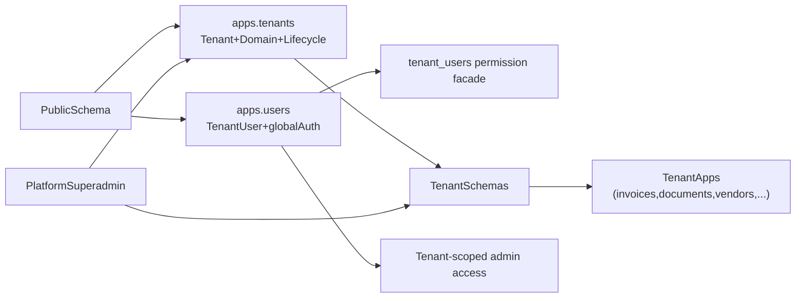

# Multitenancy Consolidation Plan

## Scope
- Introduce a canonical tenancy layer in [`/Users/tobia/Code/Projects/NinjaBit/Operational/Web/Backend/Django/6.0/operational/apps/tenants`]( /Users/tobia/Code/Projects/NinjaBit/Operational/Web/Backend/Django/6.0/operational/apps/tenants ).
- Implement full `django-tenant-users` integration with a custom user model in [`/Users/tobia/Code/Projects/NinjaBit/Operational/Web/Backend/Django/6.0/operational/apps/users`]( /Users/tobia/Code/Projects/NinjaBit/Operational/Web/Backend/Django/6.0/operational/apps/users ).
- Re-scope [`/Users/tobia/Code/Projects/NinjaBit/Operational/Web/Backend/Django/6.0/operational/apps/customers`]( /Users/tobia/Code/Projects/NinjaBit/Operational/Web/Backend/Django/6.0/operational/apps/customers ) to business-customer domain only (tenant-local), not platform tenancy.

## Target Architecture

## Phase 1 — Baseline and Package Wiring (Shared/Public)
- Update dependencies in [`/Users/tobia/Code/Projects/NinjaBit/Operational/Web/Backend/Django/6.0/operational/requirements.txt`]( /Users/tobia/Code/Projects/NinjaBit/Operational/Web/Backend/Django/6.0/operational/requirements.txt ) to include `django-tenant-users` and keep compatibility with `django-tenants` and `tenant-schemas-celery`.
- Refactor app registration in [`/Users/tobia/Code/Projects/NinjaBit/Operational/Web/Backend/Django/6.0/operational/operational/settings.py`]( /Users/tobia/Code/Projects/NinjaBit/Operational/Web/Backend/Django/6.0/operational/operational/settings.py ):
  - `SHARED_APPS`: add `apps.tenants`, `apps.users`, `tenant_users.permissions`, `tenant_users.tenants`.
  - Keep business apps in `TENANT_APPS`.
  - Ensure `INSTALLED_APPS` composition remains deduplicated.
- Add auth wiring in settings:
  - `AUTH_USER_MODEL = "users.TenantUser"`
  - `AUTHENTICATION_BACKENDS` including `tenant_users.permissions.backend.UserBackend`
  - `TENANT_MODEL` and `TENANT_DOMAIN_MODEL` pointed to `tenants` app models.
- Add/validate middleware order in settings so auth middleware precedes tenant access middleware where required.

## Phase 2 — Create Canonical `tenants` App
- Implement tenant models in [`/Users/tobia/Code/Projects/NinjaBit/Operational/Web/Backend/Django/6.0/operational/apps/tenants/models.py`]( /Users/tobia/Code/Projects/NinjaBit/Operational/Web/Backend/Django/6.0/operational/apps/tenants/models.py ):
  - `Tenant` (extends `TenantBase` if adopting full tenant-users pattern, otherwise compatible extension over `TenantMixin` with owner relation).
  - `Domain` (extends `DomainMixin`).
- Recommended tenant fields:
  - Identity: `name`, `slug`, `schema_name`, `status`, `timezone`, `locale`, `currency`.
  - Ownership/governance: `owner`, `billing_email`, `support_email`.
  - Lifecycle: `is_active`, `on_trial`, `trial_ends_at`, `paid_until`, `suspended_at`, `created_at`, `updated_at`.
  - Config surface: `settings_json` (or typed flags), `features_json`, `data_retention_days`.
- Add tenant admin in [`/Users/tobia/Code/Projects/NinjaBit/Operational/Web/Backend/Django/6.0/operational/apps/tenants/admin.py`]( /Users/tobia/Code/Projects/NinjaBit/Operational/Web/Backend/Django/6.0/operational/apps/tenants/admin.py ) with `TenantAdminMixin` and safe field exposure.
- Introduce tenant lifecycle services/commands (provision/deactivate/transfer owner) under `apps/tenants/services/` and `apps/tenants/management/commands/`.

## Phase 3 — Build Dedicated `users` App With Tenant Users
- Implement custom user model in [`/Users/tobia/Code/Projects/NinjaBit/Operational/Web/Backend/Django/6.0/operational/apps/users/models.py`]( /Users/tobia/Code/Projects/NinjaBit/Operational/Web/Backend/Django/6.0/operational/apps/users/models.py ) based on `django-tenant-users` abstractions.
- Recommended user fields:
  - Identity: `email` (unique login), `first_name`, `last_name`, `display_name`.
  - Security/status: `is_active`, `is_staff`, `is_superuser`, `last_login`, `password_changed_at`.
  - Profile prefs: `timezone`, `locale`, `avatar`, `phone`.
  - Governance/audit: `created_at`, `updated_at`, `invited_by`, `last_tenant_id`.
- Add tenant membership/role modeling (if not fully covered by tenant-users facade) in `apps/users` to support:
  - Platform superadmin (cross-tenant)
  - Tenant admin (tenant-scoped elevated rights)
  - Tenant member roles (least privilege)
- Configure user admin in [`/Users/tobia/Code/Projects/NinjaBit/Operational/Web/Backend/Django/6.0/operational/apps/users/admin.py`]( /Users/tobia/Code/Projects/NinjaBit/Operational/Web/Backend/Django/6.0/operational/apps/users/admin.py ) with tenant-aware queries/actions.

## Phase 4 — Re-Boundary Existing Apps and Fix Broken References
- Reclassify `apps/customers`:
  - Move tenant/domain classes out to `apps/tenants`.
  - Redefine `apps/customers` for business-customer entities only (tenant-local CRM/customer records).
- Fix invalid references such as invoice FK to nonexistent `customers.Customer` in [`/Users/tobia/Code/Projects/NinjaBit/Operational/Web/Backend/Django/6.0/operational/apps/invoices/models.py`]( /Users/tobia/Code/Projects/NinjaBit/Operational/Web/Backend/Django/6.0/operational/apps/invoices/models.py ) by introducing/pointing to the correct business customer model.
- Resolve overlap with [`/Users/tobia/Code/Projects/NinjaBit/Operational/Web/Backend/Django/6.0/operational/apps/organizations/models.py`]( /Users/tobia/Code/Projects/NinjaBit/Operational/Web/Backend/Django/6.0/operational/apps/organizations/models.py ) so only one canonical tenant anchor remains.
- Correct app configs (`AppConfig.name`) for new apps where currently misaligned (e.g., users/organizations placeholders).

## Phase 5 — Tenant-Safe Query, Admin, and Task Enforcement
- Audit tenant app querysets to ensure no cross-tenant leakage (views, serializers, DRF viewsets):
  - [`/Users/tobia/Code/Projects/NinjaBit/Operational/Web/Backend/Django/6.0/operational/apps/invoices/views.py`]( /Users/tobia/Code/Projects/NinjaBit/Operational/Web/Backend/Django/6.0/operational/apps/invoices/views.py )
  - [`/Users/tobia/Code/Projects/NinjaBit/Operational/Web/Backend/Django/6.0/operational/apps/documents/views.py`]( /Users/tobia/Code/Projects/NinjaBit/Operational/Web/Backend/Django/6.0/operational/apps/documents/views.py )
- Add tenant-aware filtering utilities/mixins (e.g., base viewset mixin that always scopes to current schema context).
- Make management commands tenant-aware by iterating schemas or requiring explicit tenant arguments:
  - [`/Users/tobia/Code/Projects/NinjaBit/Operational/Web/Backend/Django/6.0/operational/apps/documents/management/commands/process_invoices.py`]( /Users/tobia/Code/Projects/NinjaBit/Operational/Web/Backend/Django/6.0/operational/apps/documents/management/commands/process_invoices.py )
  - [`/Users/tobia/Code/Projects/NinjaBit/Operational/Web/Backend/Django/6.0/operational/apps/invoices/management/commands/cleanup_duplicates.py`]( /Users/tobia/Code/Projects/NinjaBit/Operational/Web/Backend/Django/6.0/operational/apps/invoices/management/commands/cleanup_duplicates.py )
- Wire Celery tenant context (bootstrap + schema-aware tasks) so background jobs execute in intended tenant schemas.

## Phase 6 — Migration Strategy (Safety-First)
- Create migrations in controlled order:
  1) new `tenants` and `users` base tables in shared schema;
  2) data migration from `customers.Client/Domain` to `tenants.Tenant/Domain`;
  3) FK remaps in tenant apps;
  4) deprecate/remove old tenancy models.
- Add reversible data migration steps and consistency checks before/after each migration.
- Plan for user migration from default auth user to custom `users.TenantUser` (requires careful staged migration and reference rewiring).

## Validation and Acceptance Criteria
- Tenant/domain resolution works from host and maps to correct schema.
- Auth login uses custom tenant user backend and enforces tenant membership access.
- Superadmin can access cross-tenant admin tooling; tenant admins are constrained to their tenant scope.
- API and admin list/detail operations cannot read/write across tenant boundaries.
- Celery tasks and management commands run tenant-scoped and do not leak data.
- `makemigrations`, `migrate_schemas`, and project checks run cleanly.

## Risks and Controls
- `AUTH_USER_MODEL` transition is high risk after initial migrations; mitigate with staged migration and strict data audits.
- Existing broken model links (e.g., invoices customer FK target) must be resolved before broad migration runs.
- Parallel tenant model definitions (`customers` vs `organizations`) can cause long-term drift; enforce single canonical tenant model in this consolidation.
