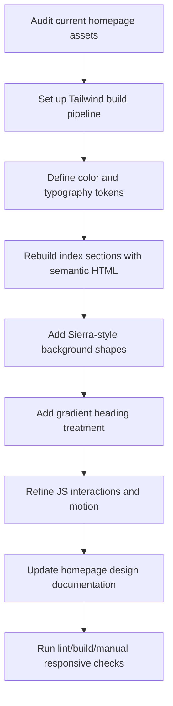

# Operational.cloud Landing Redesign Plan

## Scope
- Redesign the landing page in a modern, captivating style using:
  - Sierra-inspired decorative background color-shapes.
  - MusicChartsAI-style gradient headings/text accents.
  - HTML5 + Tailwind (build pipeline, not CDN).
- Replace current sparse copy/sections with a complete narrative for a multitenant company management platform.
- Keep homepage docs aligned with implementation updates.

## Key Files To Change
- [`/Users/tobia/Code/Projects/NinjaBit/Operational/Web/Backend/Django/6.0/operational/templates/index.html`](/Users/tobia/Code/Projects/NinjaBit/Operational/Web/Backend/Django/6.0/operational/templates/index.html)
- [`/Users/tobia/Code/Projects/NinjaBit/Operational/Web/Backend/Django/6.0/operational/static/css/home.css`](/Users/tobia/Code/Projects/NinjaBit/Operational/Web/Backend/Django/6.0/operational/static/css/home.css) (or replaced by compiled Tailwind output)
- [`/Users/tobia/Code/Projects/NinjaBit/Operational/Web/Backend/Django/6.0/operational/static/js/home.js`](/Users/tobia/Code/Projects/NinjaBit/Operational/Web/Backend/Django/6.0/operational/static/js/home.js)
- [`/Users/tobia/Code/Projects/NinjaBit/Operational/Web/Backend/Django/6.0/operational/docs/plans/homepage_design.md`](/Users/tobia/Code/Projects/NinjaBit/Operational/Web/Backend/Django/6.0/operational/docs/plans/homepage_design.md)
- New Tailwind setup files (to be added): `package.json`, `tailwind.config.js`, `postcss.config.js`, Tailwind input stylesheet, compiled output stylesheet.

## Information Architecture And Content Plan
- **Hero**
  - H1: clear value proposition for Operational as a multitenant company management platform.
  - Supporting paragraph: unify finance, management, operations, R&D, publishing in one workspace.
  - Primary CTA: `Request Demo` (or `Get Started` depending on business intent).
  - Secondary CTA: `See Platform Areas`.
- **Trust / Proof strip**
  - 3-4 stat chips (e.g., teams onboarded, active projects, process coverage) using placeholder metrics until real numbers are provided.
- **Platform Areas grid (core section)**
  - Finance
  - Management
  - Operations
  - Research & Development
  - Publishing
  - Additional suggested areas (missing and high-value):
    - **Compliance & Governance** (audit trails, policies, approvals)
    - **People & Access** (roles, permissions, tenant/user controls)
    - **Integrations & Automation** (external services, sync jobs, workflows)
    - **Knowledge & Decisions** (SOPs, docs, architecture decisions)
- **How it works (3 steps)**
  - Connect your company context.
  - Structure workflows by area.
  - Monitor execution and outcomes.
- **Benefits / outcomes section**
  - Improved visibility, reduced context switching, stronger governance, reusable operational knowledge.
- **Final CTA section + footer**
  - Strong conversion section with gradient heading and modern visual shapes.

## UI/Style Direction (Light-First)
- **Visual baseline**: Sierra-like clean light canvas with layered abstract background blobs/shapes.
- **Brand accents**: gradient text for major headings and key metrics (MusicChartsAI-inspired treatment).
- **Palette strategy**:
  - Light neutrals for page background/surfaces.
  - 2-3 accent hues for gradients and shape layers.
  - Higher-contrast text for accessibility.
- **Components**:
  - Rounded cards with soft borders/shadows.
  - Gradient badges/chips for area labels.
  - Subtle micro-interactions on hover/focus.
- **Responsiveness**:
  - Mobile-first spacing and type scale.
  - Shape density reduced on small screens for clarity/performance.

## Technical Execution Flow

## Risks And Guardrails
- Existing homepage currently uses custom CSS + GSAP/Flubber; migration to Tailwind must avoid visual regressions and unnecessary JS complexity.
- Keep decorative shapes non-intrusive and accessible (proper contrast, no text-obscuring overlays).
- Respect reduced-motion preferences and keep animation optional/subtle.
- Ensure copy remains scannable and conversion-focused (avoid overly generic marketing text).

## Validation Criteria
- Tailwind build works locally and generated CSS is loaded correctly by Django staticfiles.
- Landing visually matches requested style direction (Sierra structure + modern gradients).
- All key platform areas are represented with concise, clear messaging.
- Mobile/tablet/desktop layouts are stable.
- `homepage_design.md` reflects final structure, styling system, and implementation notes.
