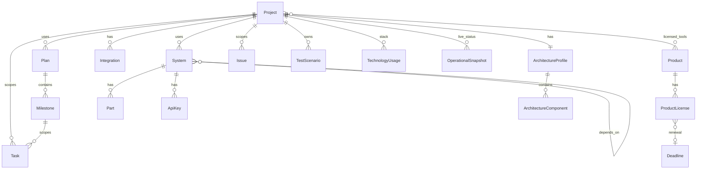

# Project management features plan

Consolidates [operational_project_plan.md](docs/plans/operational_project_plan.md), [operational-requirements.md](docs/requirements/operational-requirements.md), [operational_use_cases_vs_apps.md](docs/plans/operational_use_cases_vs_apps.md). Module definitions: [projects_module.md](docs/plans/projects_module.md), [products_module.md](docs/plans/products_module.md).

**Corrected terminology:** **Projects** ≠ **Products**.

| | **Project** | **Product** |
|---|-------------|-------------|
| **What** | Work you build/operate | Things you buy/license |
| **Examples** | Operational web app, client portal | Cursor IDE, Creative Tim pack, Figma |
| **App** | `apps.projects` (activate) | `apps.products` (repurpose) |
| **Hub for** | Plans, systems, architecture, tasks, issues, tests | Licenses, renewals, vendor, cost |
| **Lifecycle** | idea / dev / testing / live / archived | License active / expired / trial |

---

## Current state (code vs docs)

| Area | Implemented | Gap |
|------|-------------|-----|
| **Project** | None; `apps/projects` empty, not in `TENANT_APPS` | Add `Project`; install app; all composition relations |
| **Product (commercial)** | `Product` with **wrong** project semantics (`status` live/dev/testing) | Reshape for vendor/licenses; **ProductLicense** |
| **System** | Types + environment | Project M2M, deps, topics |
| **Part** | GFK to System/**Product** | Repoint to **Project**/System; ApiKey/Credential |
| **Plan / Task** | Milestone→Plan | Project FKs/M2Ms |
| **Architecture / Issues / Tests** | None | Per project |

---

## Design principles

1. **`Project` is the PM hub** — plans, systems, parts, architecture, integrations (tenant), tasks, issues, tests, operational snapshots.
2. **`Product` is the commercial catalog** — vendor offerings, license/subscription records, renewals; optional M2M to projects (“tools used on this initiative”).
3. **Two layers for structure on projects:**
   - **System** — logical capabilities (auth, API, MCP, …)
   - **ArchitectureComponent** — infra registry (DB, broker, balancer, …)
4. **Runtime secrets** (ApiKey, Credential, Part) → **Project** or **System**. **Vendor license keys** → **ProductLicense** (or Part on Product).
5. **Platform integrations** (Stripe for your app) → **Services** / **Integrations**, scoped to **project** where relevant.
6. **Registry-first** architecture UI; lightweight issues; Topics consolidated in `apps/topics`.

---

## Target domain model

---

## 1. Projects (`apps.projects`)

See [projects_module.md](docs/plans/projects_module.md).

### 1.1 Project model

| Field | Notes |
|-------|-------|
| `name`, `slug`, `description` | |
| `status` | idea, dev, testing, live, archived (**moved from current Product**) |
| `owner` | FK User, nullable |
| `topics` | M2M |

### 1.2 Composition (on Project)

| Relation | Type |
|----------|------|
| `plans` | M2M → Plan |
| `systems` | M2M → System |
| `milestones` | optional M2M → Milestone |
| `products` | M2M → Product (through: role, notes) — licensed tools |
| Integrations | FK `project` on tenant Integration model |

**Project detail view:** plans, systems, parts/keys, architecture, stack, integrations, licensed products, tasks, issues, tests, knowledge links.

### 1.3 Systems, parts, architecture, stack

- **System:** extend types; `depends_on`; M2M **projects** (“used by”).
- **Part / ApiKey / Credential:** GFK parent **Project** or System.
- **ArchitectureProfile:** FK **`project`** (not product).
- **TechnologyUsage:** GFK parent **Project** or System.
- **Integration:** optional FK **project**.
- **Solution (ADR):** FK **project**.

---

## 2. Products (`apps.products`)

See [products_module.md](docs/plans/products_module.md).

### 2.1 Product (commercial catalog)

| Field | Notes |
|-------|-------|
| `name`, `slug` | |
| `vendor` | CharField or FK Vendor (later) |
| `product_kind` | saas, template_pack, ide, design_tool, cloud_service, asset_library, other |
| `description`, `homepage_url`, `docs_url` | |
| `topics` | M2M |

**Remove from Product:** `status` idea/dev/testing/live (belongs on **Project**).

### 2.2 ProductLicense (subscriptions & licenses)

| Field | Notes |
|-------|-------|
| `product` | FK Product |
| `license_type` | perpetual, subscription, trial, seat_based, usage_based, open_source |
| `seats` | optional PositiveIntegerField |
| `started_at`, `ends_at` | |
| `renewal_interval` | none, monthly, yearly, custom |
| `status` | active, expired, cancelled, trial |
| `cost`, `currency` | optional |
| `license_key_masked` | or GFK to Part for secret storage |
| `notes` | |

Link **Deadline** (renewal) and optional **Transaction** (Money).

### 2.3 Project ↔ Product

M2M with through model `ProjectProduct`: `project`, `product`, `role` (e.g. “UI templates”, “IDE”), `notes`.

---

## 3. Software architecture registry (`architecture` app)

Unchanged intent; scoped to **Project**:

- **ArchitectureProfile** → FK `project`
- **ArchitectureComponent**, **ArchitectureConnection** — registry-first UI
- Component types: database, message_broker, load_balancer, cache, …

---

## 4. Project status and operations

| Model | Scoped to |
|-------|-----------|
| **OperationalSnapshot** | Project |
| **Task** | FK project, plan, milestone |
| **Issue** (lightweight) | FK project, optional system |
| **TestScenario / TestRun** | FK project |
| **PlannedCheck** (optional) | FK project, system |

---

## 5. Migration / code cleanup

1. Add `apps.projects` to `TENANT_APPS`.
2. Create `Project`; migrate data from `products_product` if any rows exist.
3. Reshape `Product`: drop lifecycle status; add vendor/kind; add `ProductLicense`.
4. Update `Part` GFK allowed types: Project, System (data migration from Product parents).
5. Update model docstrings ([`apps/products/models.py`](apps/products/models.py) today says “project or product type” — fix).
6. Dashboard widget: **Projects** (not Products) for PM summary; separate widget for **licenses expiring** optional.

---

## 6. Phased delivery

| Phase | Scope |
|-------|--------|
| **0 — Split** | Install projects; Project + Product reshape + ProductLicense; GFK migration |
| **1 — Composition** | Project M2Ms; Task/Integration FKs; Project↔Product tools |
| **2 — Parts & security** | ApiKey/Credential; deadlines; rotation |
| **3 — Architecture & stack** | architecture app; Technology on Project |
| **4 — Status** | Issues, tests, operational snapshots |
| **5 — Knowledge graph** | Relations incl. Project and Product nodes |

---

## 7. Decisions recorded

| Topic | Decision |
|-------|----------|
| Project entity | **`Project`** in `apps.projects` (activate app) |
| Product entity | **Commercial** catalog + **ProductLicense**; not a project container |
| Misunderstanding | Prior docs/code conflated them; **corrected** in plans and requirements |
| PM hub | **Project** owns plans/systems/architecture/tasks |
| Licensed tools | **Product** M2M **Project** |
| Issues | Lightweight, on Project |
| Architecture UI | Registry-first, per Project |

---

## 8. Docs updated (this iteration)

- [docs/plans/products_module.md](docs/plans/products_module.md) — new
- [docs/plans/projects_module.md](docs/plans/projects_module.md) — new
- [docs/plans/operational_use_cases_vs_apps.md](docs/plans/operational_use_cases_vs_apps.md) — rewritten
- [docs/plans/operational_project_plan.md](docs/plans/operational_project_plan.md) — §10.11 Projects, §10.12 Products, module table, decisions
- [docs/requirements/operational-requirements.md](docs/requirements/operational-requirements.md) — split Projects vs Products modules
- [docs/dev/architecture_scaffold.md](docs/dev/architecture_scaffold.md) — app roles

---

## 9. Out of scope

- Implementing migrations/views (until execute phase)
- Full issue tracker; architecture React Flow editor (later)
- Money/Accounting detail (use case 4; links noted: project + product_license)
