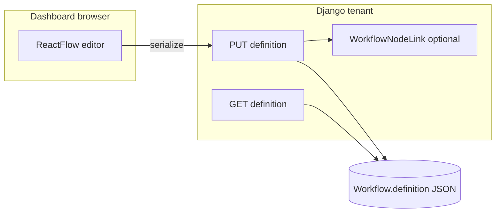

# React Flow workflow editor and modeling

## Context (current state)

- [`apps/workflows/models.py`](apps/workflows/models.py): single `Workflow` with `definition` JSONField; `category`, slug, etc.
- [`apps/workflows/services/definition_validate.py`](apps/workflows/services/definition_validate.py): validates `schemaVersion`, `nodes[]` (`id`, `type`, `data`, optional `position`), `edges[]` (`source`/`target`), `viewport`.
- [`apps/workflows/views_api.py`](apps/workflows/views_api.py): session-authenticated GET/PUT of `definition`.
- Dashboard editor is [`apps/workflows/templates/workflows/dashboard_editor.html`](apps/workflows/templates/workflows/dashboard_editor.html) + Alpine/AlpineFlow; list/create remain server-rendered.
- [`package.json`](package.json): no React toolchain today (Tailwind CLI + AlpineFlow vendor only).

React Flow (@xyflow/react) expects a **document-shaped** graph in the client: `nodes` with `id`, `position: {x,y}`, `type`, `data`, and `edges` with `id`, `source`, `target`, optional handles/types. Keeping that shape in JSON is the path of least resistance; **normalizing every node and edge into ORM tables** is workable but means every UI interaction maps to writes/joins and you must keep RF state and DB in lockstep (higher cost, better for heavy reporting/SQL across graphs).

**Recommendation given your uncertainty:** treat **`Workflow.definition` as the canonical React Flow document** (schema bump, e.g. `schemaVersion: 2`, `meta.engine: "react-flow"` or similar), and add **one lean link model** for knowledge-base tracking:

- e.g. `WorkflowNodeLink(workflow, node_id, content_type, object_id, role, created_at)` with `GenericForeignKey` (pattern already exists in [`apps/parts/models.py`](apps/parts/models.py)).
- Node `data` in JSON can mirror `link_ids` or denormalized labels for the UI; server validates link rows on save or via separate small API.

If you later need **full SQL over graphs**, migrate to `WorkflowNode` / `WorkflowEdge` tables and treat JSON as a cache/export—do not block the first React delivery on that.

## Scope boundaries

- **In scope:** workflow **editor** (and minimal glue: mount root, CSRF session fetch to existing API, loading/error states). Optionally simplify toolbar UX on list/create pages later; they can stay Django templates + HTMX.
- **Out of scope (initial slice):** rewriting the entire dashboard off Alpine; only remove AlpineFlow from the editor route and stop loading Alpine-only assets there.

## Frontend: React + React Flow “island”

1. **Tooling:** Add a small **Vite** (or esbuild) React bundle under e.g. `frontend/workflow-editor/` producing `static/js/workflow-editor.js` (+ CSS chunk). Wire npm scripts: `build:workflow`, `watch:workflow`, call from CI/local dev.
2. **Mount:** Editor template exposes `
` and loads the built script (via ``). No SPA router required.
3. **Auth:** Reuse [`WorkflowDefinitionAPIView`](apps/workflows/views_api.py) with `fetch(..., credentials: 'include')` and `X-CSRFToken` (same as today’s Alpine `persist`).
4. **UX baseline:** React Flow with `Background` (subtle grid), `Controls`, `MiniMap` (optional), `Panel` for add-node palette, **click selection** opens a right-side **Inspector** (controlled `data` edits), onConnect for edges, delete key / context menu later.
5. **Remove:** AlpineFlow assets and inline Alpine `workflowPage` from the editor template once parity is reached for save/load.

## Backend: definition contract and migration

1. **Define `schemaVersion: 2`** (or keep `1` if you prefer—but a version flag helps migrations) with documented shape aligned to @xyflow/react:
   - `nodes[]`: at minimum `id`, `type`, `position`, `data`; allow RF extras you choose to persist (`measured`, `selected`, etc.) or strip on save via a single `sanitize_react_flow_definition()` helper.
   - `edges[]`: `id`, `source`, `target`, optional `sourceHandle` / `targetHandle`, `type`, `data`, `markerEnd`, etc., as needed.
   - `viewport` / `meta`: keep `meta.category` and tenant rules from [`normalize_definition`](apps/workflows/services/definition_validate.py).

2. **Rewrite validation** in [`definition_validate.py`](apps/workflows/services/definition_validate.py) for v2 (or branch on `schemaVersion`): validate node/edge referential integrity, duplicate ids, allowed `type` strings per `workflow.category` (reuse / extend [`node_card_registry.py`](apps/workflows/services/node_card_registry.py) and [`workflow_categories.py`](apps/workflows/services/workflow_categories.py)).

3. **Data migration:** `RunPython` or management command to **convert existing v1** definitions (AlpineFlow-ish) to v2: preserve `id`/`type`/`data`, assign initial `position` (grid or simple layout) so RF does not stack everything at origin; map edges to RF `id` fields.

4. **Update** [`default_workflow_definition`](apps/workflows/services/default_definition.py) to emit v2 for new workflows.

5. **Admin:** [`WorkflowAdmin`](apps/workflows/admin.py) can keep JSON preview or link “Open in dashboard editor”; no requirement to embed React in Unfold for v1.

## Generic relations (knowledge tracking)

1. Add **`WorkflowNodeLink`** (name TBD) in `apps/workflows/models.py` with:
   - `workflow` FK, `node_id` (CharField, matches RF `node.id`),
   - `content_type` + `object_id` + `GenericForeignKey`,
   - optional `role` / `notes` for “primary evidence”, “related SOP”, etc.

2. **API strategy (pick one in implementation):**
   - **A)** Extend PUT payload with optional `links: [...]` processed transactionally with definition save; or
   - **B)** Separate REST endpoints `POST/DELETE /api/workflows/<uuid>/nodes/<nodeId>/links/` to avoid bloating graph PUT.

3. **Validation:** ensure `node_id` exists in the saved definition’s `nodes` before creating a link row.

## Testing and rollout

- Extend [`apps/workflows/tests.py`](apps/workflows/tests.py) (or split) for v2 definition validation, migration sample graph, and optional link validation.
- Manual QA checklist: large graph, dark mode, save round-trip, tenant switch.

## “Ditch Alpine entirely”

Defer **global** Alpine removal: other dashboard pages still use it. After the editor island is stable, you can **incrementally** replace other pages or keep Alpine for low-interaction screens.

## Risks / trade-offs to accept up front

- **Full ORM graph (every node/edge row)** gives the strongest referential integrity and SQL analytics but is the largest build; the hybrid above ships faster and still satisfies “GFK to knowledge objects” via `WorkflowNodeLink`.
- React bundle adds **build step** and ~vendor size; mitigate with route-level code splitting and lazy mount.
