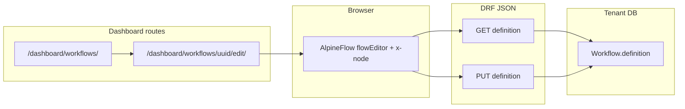

# Workflows engine (v1): app, admin CRUD, dashboard canvas

## Scope for this iteration

- **In scope:** New `apps/workflows` tenant app, `Workflow` model storing a **graph document** serializable from the dashboard editor, Unfold `ModelAdmin` for basic CRUD, dashboard routes under the existing [`/dashboard/`](operational/urls.py) prefix, **save/load** via a small JSON API (session-backed DRF, consistent with other tenant apps such as [`apps/invoices/views.py`](apps/invoices/views.py)).
- **Canvas stack:** **[AlpineFlow](https://github.com/copyfactory/AlpineFlow)** (`@copyfactory/alpine-flow`, **MIT**) — Alpine.js `x-node` components + `flowEditor` with `editor.toObject()` / `flowEditor(initialState)` for persistence. Fits the existing dashboard (Alpine already in [`apps/dashboard/templates/dashboard/base.html`](apps/dashboard/templates/dashboard/base.html)) and avoids introducing **React only for the flow UI**.
- **Mandatory UX:** Each logical **step is a complex node**: multi-row chrome (title, status, badges, optional “source / tools / assignee” fields), not a single-line box. Use AlpineFlow’s pattern: **`props` = persisted fields**, sibling state for purely visual/ephemeral UI ([AlpineFlow README — node `props`](https://github.com/copyfactory/AlpineFlow)). **Junctions** use node config (`allowBranching`, `allowChildren`, `deletable`) per type, aligned with [Workflow86](https://www.workflow86.com)-style splits/gates vs linear steps.
- **Langflow:** [Langflow](https://www.langflow.org) / [langflow-ai/langflow](https://github.com/langflow-ai/langflow) is **MIT**. Use it as **architecture and schema inspiration** (flow JSON, “component type” catalog, node data vs edges, validation discipline)—**not** as an embedded editor or copied React subtree (their UI is React Flow–based and would fight our Alpine-first dashboard). Optionally read their `DESIGN.md` / flow export shapes when tightening our `schemaVersion` and server-side validation.

- **Out of scope (defer):** Workflow runtime/execution (Celery triggers, per-node runners), Langflow-style MCP/API hosting, publishing/version tables, multiplayer editing, and full parity with Workflow86 (tables, forms, agent inbox).

## Placement: django-tenants

- Register **`apps.workflows` in `TENANT_APPS`** in [`operational/settings.py`](operational/settings.py) (same reasoning as [`apps/knowledge`](apps/knowledge/models.py): per-tenant knowledge and internal processes). Do **not** duplicate in `SHARED_APPS`.
- Add **`workflows` to `DefaultBusinessPermissionsPolicy.APP_LABELS`** in [`apps/users/services/default_business_permissions_policy.py`](apps/users/services/default_business_permissions_policy.py) so staff picks up model permissions after migrations (re-run `sync_default_business_permissions` for existing tenants when shipping).

## Data model

- **`Workflow`**: `name`, optional `slug` (`unique=True` per tenant table), `description` (blank), **`definition` (`JSONField`, default=dict)**.
- **Persistence shape:** Align with **AlpineFlow’s `toObject()` output**: `{ "nodes": [...], "edges": [...], "viewport": {...} }` (see [AlpineFlow flowEditor / toObject](https://github.com/copyfactory/AlpineFlow)). Each node entry carries `id`, `type`, and persisted **`data`** (AlpineFlow merges template `props` into node `data` when serializing—treat whatever the library emits as the source of truth and **pin the library version** in package.json or lock CDN URL to a versioned unpkg path).
- Add **`schemaVersion`** (top-level key inside `definition`, e.g. `1`) for forward-compatible migrations of node `data` shapes.
- **Rich node contract:** For each supported `type` (e.g. `step`, `junction`, `merge`, `humanGate`), define a **small JSON schema or pydantic/dataclass validator** in `apps/workflows/services/` (one module per concern) so bad drafts from the admin textarea cannot corrupt the editor.
- **One class per file** (project convention): validators, serializers, and “default new workflow” factories live under `apps/workflows/services/`.

## Admin (simple CRUD)

- [`apps/workflows/admin.py`](apps/workflows/admin.py): Unfold `ModelAdmin` like [`apps/knowledge/admin.py`](apps/knowledge/admin.py): `list_display`, `search_fields`, `prepopulated_fields` for slug. For `definition`, prefer **readonly + “edit on dashboard”** or a collapsed raw JSON field—admin is escape hatch, not the primary editor.

## Dashboard UI (canvas only here)

- **Routing:** Extend [`apps/dashboard/urls.py`](apps/dashboard/urls.py) with `path("workflows/", include("apps.workflows.urls_dashboard"))` so URLs stay under `/dashboard/workflows/...`.
- **Templates:**
  - **List:** List workflows with links to the editor (`nav_active` for sidebar).
  - **Editor:** Full-height `<main>` region with:
    - **Canvas:** `x-data="editor = flowEditor({ nodes, edges, viewport })"` initialized from server JSON; hidden **template `x-node` definitions** (or `x-ignore` inner pattern per AlpineFlow docs) for each node type—each template implements the **Workflow86-like** dense card UI using existing dashboard Tailwind tokens.
    - **Inspector (optional v1):** Alpine sidebar bound to selected node id to edit `props` / `data` fields (Langflow-inspired “click node → edit parameters” pattern, implemented in Alpine).
    - **Save:** `@flow-nodes-updated.window` (and related `flow-*` events from AlpineFlow) → debounced `fetch` PUT to DRF with `X-CSRFToken`.

### AlpineFlow integration notes (findings)

- **License:** MIT ([AlpineFlow LICENSE](https://github.com/copyfactory/AlpineFlow/blob/main/LICENSE)).
- **Capabilities:** Directed / DAG-oriented editor, automatic layout + edges, zoom/pan/drag, toolbar hooks, `addNode` / `deleteNode` / graph traversal APIs, `toObject()` for DB round-trip ([README](https://github.com/copyfactory/AlpineFlow)).
- **Dependencies inside the library:** Dagre (layout), d3-zoom (viewport)—no React.
- **Loading strategy:** Either **npm** `npm i @copyfactory/alpine-flow` and a small static init script that registers `Alpine.plugin(node)` + `Alpine.data('flowEditor', flowEditor)` before `Alpine.start()`, **or** version-pinned CDN (`flow.css` + `alpine-flow.cdn.min.js`) consistent with current Alpine CDN usage—**document script order** (AlpineFlow examples link CSS + alpine-flow before Alpine; follow their quickstart to avoid init races).
- **Tradeoff vs React Flow:** Smaller ecosystem and feature surface; acceptable given explicit goal to **avoid React for flow only**. If future requirements exceed AlpineFlow (e.g. advanced edge editing), reassess behind a `schemaVersion` migration.

## API

- **`apps/workflows/views_api.py`**: DRF `RetrieveUpdateAPIView` (or split files) with `SessionAuthentication` + `IsAuthenticated`; GET/PUT the `definition` JSON body.
- Include under dashboard prefix, e.g. `path("workflows/api/", include(...))` with named routes for templates.
- **CSRF:** `fetch` with `X-CSRFToken` from `csrftoken` cookie.

## Tests

- Dashboard list/editor templates return 200 (extend patterns from [`apps/dashboard/tests.py`](apps/dashboard/tests.py) if auth allows).
- **`apps/workflows/tests.py`:** Authenticated GET/PUT round-trip; optional tests for `definition` validation service.

## npm / static assets

- **Preferred:** Add `@copyfactory/alpine-flow` to [`package.json`](package.json) and copy or reference `dist/flow.css` + bundle entry from `node_modules` into `static/` via a tiny build script **or** document version-pinned CDN URLs in the editor template (no React/esbuild pipeline required for the canvas).
- **Tailwind:** Node markup lives in Django templates; existing [`static/css/dashboard.input.css`](static/css/dashboard.input.css) `@source` already includes `apps/**/templates/**/*.html`—ensure new workflow templates path is covered (adjust `@source` only if templates live outside matched globs).

## Migration and wiring checklist

- `startapp workflows apps/workflows` (per [django-create-app skill](.cursor/skills/django-create-app/SKILL.md)).
- Register app, urls, admin, permissions policy.
- `makemigrations` / `migrate` per django-tenants workflow (no destructive DB ops).

## Future hooks (not implemented now)

- **Execution:** map node `type` + `data` to Celery tasks or HTTP webhooks; `WorkflowRun` model for state.
- **Knowledge linking:** FK/M2M from `Workflow` to knowledge entities when the graph is also a knowledge map.
