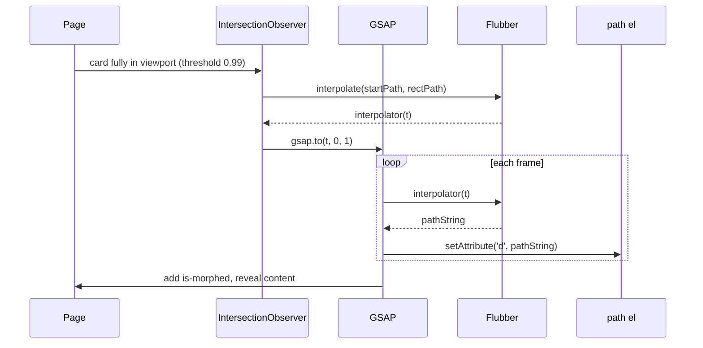

# Operational Homepage — Design and Implementation Plan

## Overview

Plan for a distinctive, animated homepage in `templates/index.html` that presents Operational as an advanced company management tool (projects, financials, personnel, knowledge), using SVG morphing animations and a proposed color palette and animation stack.

---

## Implementation status

**Done:**

- [templates/index.html](templates/index.html) — Full markup: header, hero, features grid, footer; section separators; four cards with `data-shape` and size classes; initial SVG paths per shape; GSAP + Flubber from CDN, [static/js/home.js](static/js/home.js).
- [static/css/home.css](static/css/home.css) — Palette variables, typography (Plus Jakarta Sans, DM Sans), layout, card size modifiers, staggered grid, section separators, gradient background in features, **fixed transparent header with scroll state (rounded solid bar)**, reduced-motion rules.
- [static/js/home.js](static/js/home.js) — Per-card viewBox parsing; four start shapes (circle, square, triangle, blob) and rounded-rect end shape; Flubber interpolator per card; Intersection Observer with `threshold: 0.99` (morph when card is fully in view); **header scroll handler (toggle `.page-header--scrolled`)**; `prefers-reduced-motion` support; no-js → js class swap.
- [operational/settings.py](operational/settings.py) — `STATICFILES_DIRS = [BASE_DIR / "static"]` (already present).

**Note:** The root URL may 404 with “No tenant for hostname” until a tenant (or public schema) is configured for the host. The index view and template are correct.

---

## Post-launch improvements (implemented)

These were added after the initial implementation:

1. **Varied content box sizes and positions**
   - Card size modifiers: `--sm` (280×180), `--md` (320×200), `--lg` (380×220), `--xl` (400×240). Cards use lg, md, md, xl.
   - Staggered grid: different `justify-self` and top margins so cards don’t align (e.g. card 1 top-right, 2 lower-left, 3 lower-right, 4 lower-left with more offset). Larger gaps (`--space-3xl` / `--space-2xl`) so background is visible between cards.
   - Features section has a subtle vertical gradient (teal tint in the middle) to give “room” for a nice background.

2. **Section separators**
   - **Hero → Features:** Tall wave separator (SVG path, viewBox `0 0 1440 140`), filled with `--color-surface`, 140px tall. **Both edges are wavy:** top edge uses one wave path (Q curves), bottom edge uses a different wave path (same wave effect, different control points) so the band has two distinct waves.
   - **Features → Footer:** Diagonal cut (SVG triangle, viewBox `0 0 1440 60`), same fill, 60px tall.
   - Both use `preserveAspectRatio="none"` and CSS `height`; path uses `fill: currentColor` with `color: var(--color-surface)`.

3. **Morph only when SVG is fully in view**
   - Intersection Observer uses `threshold: 0.99` and `rootMargin: "0px"` so the morph runs only when (almost) the entire card is in the viewport. Animations no longer all fire at once; each card morphs when it comes fully into view.

4. **Different start shapes per card**
   - **Card 1 (Projects):** `data-shape="circle"` — circle → rounded box (viewBox 380×220).
   - **Card 2 (Financial):** `data-shape="square"` — square with inset → rounded box (320×200).
   - **Card 3 (Personnel):** `data-shape="triangle"` — triangle → rounded box (340×210).
   - **Card 4 (Knowledge):** `data-shape="blob"` — organic blob → rounded box (400×240).
   - JS: `getStartPath(shape, w, h)` returns circle, square, triangle, or blob path from the card’s viewBox; `roundedRectPath(w, h)` is the shared end shape. Each card’s initial `<path d="...">` in the template matches its start shape for correct no-JS / pre-morph display.

5. **Header: transparent at top, rounded solid bar when scrolled**
   - Header is `position: fixed`, transparent background and border by default. When the user scrolls down past a threshold (80px), add class `page-header--scrolled`: solid `--color-surface` background, full border-radius (pill), horizontal and top margin, box-shadow. When scrolling back to the top, remove the class so the header is transparent again.
   - **CSS:** `.page-header` has transparent default state and transitions; `.page-header--scrolled` applies rounded pill style and shadow. `main` has `padding-top: 72px` for the fixed header. Under `prefers-reduced-motion`, header transitions are disabled.
   - **JS:** `setupHeaderScroll()` in [static/js/home.js](static/js/home.js) runs on init, toggles `page-header--scrolled` when `window.scrollY > 80`, uses a passive scroll listener.

---

## 1. Color palette

| Role                | Name               | Hex       | Usage                       |
| ------------------- | ------------------ | --------- | --------------------------- |
| Background          | **Slate**          | `#0f1419` | Page and card backgrounds   |
| Surface             | **Slate elevated** | `#1a2027` | Cards, nav, elevated panels |
| Border / subtle     | **Slate border**   | `#2d3748` | Dividers, borders           |
| Primary accent      | **Teal**           | `#0d9488` | CTAs, links, key icons      |
| Primary hover       | **Teal light**     | `#14b8a6` | Hover states                |
| Muted text          | **Slate muted**    | `#94a3b8` | Secondary copy              |
| Body text           | **Slate text**     | `#e2e8f0` | Headings and body           |
| Success / highlight | **Amber**          | `#f59e0b` | Badges, “new” or highlights |

Use CSS custom properties in `:root` (e.g. `--color-bg`, `--color-accent`). Typography: **Plus Jakarta Sans** (headings), **DM Sans** (body), from Google Fonts.

---

## 2. Animation stack (SVG shapes → content boxes)

**Used: Flubber + GSAP (core)**

- **Flubber:** Interpolates between two SVG path strings and returns an interpolator `t => pathString` for `t in [0, 1]`. Avoids inversions and jumps. Loaded from unpkg CDN.
- **GSAP (core):** Drives `t` from 0 to 1 with duration and easing (`power2.out`); on each frame the path’s `d` is set from the Flubber interpolator.

Flow: per card, read `data-shape` and SVG `viewBox` → build start path (circle, square, triangle, or blob) and end rounded-rect path → `flubber.interpolate(startPath, endPath)` → when card is fully in view, `gsap.to(obj, { t: 1, ... onUpdate: path.setAttribute('d', interpolator(obj.t)) })` → on complete, add `is-morphed` and show content.

**Progressive enhancement:** `<html class="no-js">` by default; script replaces with `js` and hides card content until morph completes. With no JS or when reduced motion is preferred, content is visible and morph is skipped or instant.

---

## 3. Homepage structure

- **Header:** Fixed at top; transparent by default, transforms into a rounded pill bar with solid background when scrolled down (and back to transparent when at top). Logo “Operational”, “Log in” → `/admin/`.
- **Hero:** Title “Operational”, tagline (company management: projects, activities, financials, personnel, knowledge), decorative background blob SVG, “Get started” CTA → `/admin/`.
- **Wave separator:** SVG wave between hero and features.
- **Features:** Section title “What you can manage”; grid of four cards with staggered positions and varied sizes; gradient background; each card: SVG path (start shape) that morphs into rounded box, then content (icon, title, description) fades in.
- **Diagonal separator:** SVG diagonal between features and footer.
- **Footer:** “Operational” brand, “Admin” link.

Animation is subtle: one morph per card when fully in view; `prefers-reduced-motion` respected.

---

## 4. Technical implementation summary

- **Template:** Single self-contained [templates/index.html](templates/index.html). Semantic structure; ``; link to [static/css/home.css](static/css/home.css) and [static/js/home.js](static/js/home.js); GSAP and Flubber from CDN; four cards with `data-shape`, size class, and initial path `d` matching start shape.
- **CSS:** [static/css/home.css](static/css/home.css) — variables, layout, **fixed header (transparent / `.page-header--scrolled` rounded pill)**, card modifiers (`--sm`, `--md`, `--lg`, `--xl`), staggered grid, section separators (`.section-sep`, `.section-sep--wave`, `.section-sep--footer`), features gradient, reduced-motion overrides.
- **JS:** [static/js/home.js](static/js/home.js) — **`setupHeaderScroll()` (scroll threshold 80px, toggle `page-header--scrolled`)**; `roundedRectPath(w,h)`, `circlePath(w,h)`, `squarePath(w,h)`, `trianglePath(w,h)`, `blobPath(w,h)`, `getStartPath(shape,w,h)`, `parseViewBox(svg)`; per-card interpolator; Intersection Observer `threshold: 0.99`; no new Python or Django URL changes.

---

## 5. File and dependency summary

| Item                       | Role                                                                 |
| -------------------------- | --------------------------------------------------------------------- |
| templates/index.html       | Markup, section separators, cards with data-shape and size classes.   |
| static/css/home.css        | Palette, typography, layout, fixed header (transparent / rounded solid on scroll), separators, card sizes, staggered grid. |
| static/js/home.js          | Header scroll state; Flubber + GSAP morphs; four start shapes; full-in-view trigger.       |
| GSAP (unpkg)               | Timeline and easing for morph animation.                              |
| Flubber (unpkg)            | Path interpolation blob/circle/square/triangle → rounded rect.         |
| Google Fonts               | Plus Jakarta Sans, DM Sans.                                           |

No new Python dependencies or Django apps; no backend URL/view changes beyond the existing index view.

---

## 6. Animation flow (per card)

---

## 7. Out of scope (for later)

- HTMX or dynamic content loading on this landing (static is enough).
- Tenant-specific branding or multi-domain logic on the homepage (can be added later).
- Dark/light theme toggle (palette is dark-first; a second set of variables can be added later).
