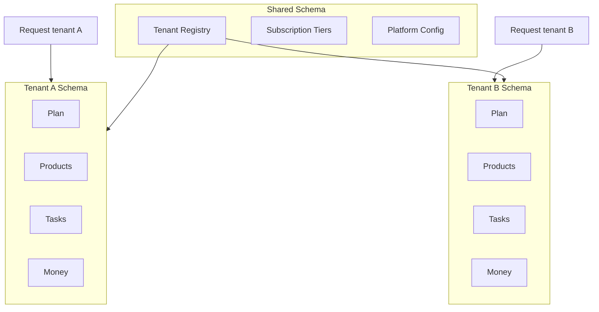
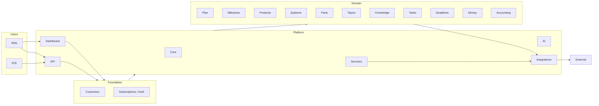
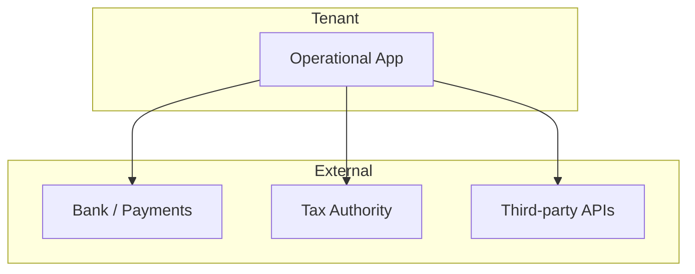
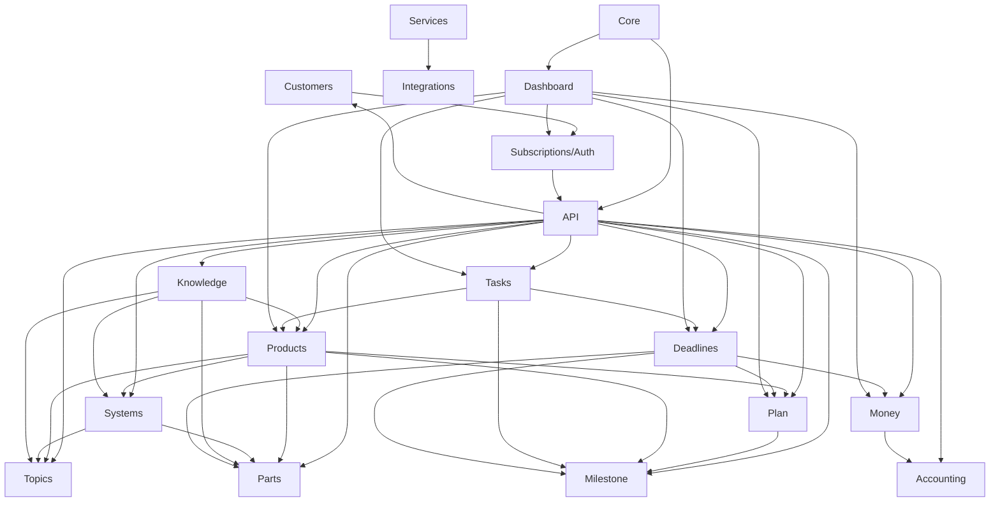
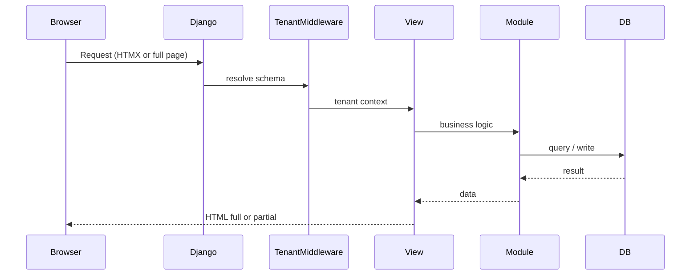

# Operational — Project Plan

High-level plan, module overview, and feature set. Implementation details live in [docs/dev/](../dev/); per-module plans in [docs/plans/](.) (e.g. `tasks_module.md`).

**Source of truth:** [docs/requirements/operational-requirements.md](../requirements/operational-requirements.md)

---

## 1. Vision and scope

Operational is a **management, knowledge base, and monitoring dashboard** intended to cover every need of a company. It supports:

- **Planning and execution** — plans, milestones, products, tasks, deadlines.
- **Systems and parts** — reusable systems (infra, auth, APIs, etc.) and traceable parts (tokens, accounts, keys).
- **Knowledge** — articles and a **node graph** (e.g. React Flow) showing what everything is made of and how it connects.
- **Topics** — main concepts that tag and unify knowledge, products, parts, and systems.
- **Money and accounting** — expenses, earnings, budgets, trends, and tax reporting.
- **Dashboard** — one place to monitor and reach all features at a glance.

---

## 2. Multi-tenancy: foundation of planning and development

**Multi-tenancy is the primary architectural driver.** Every design choice—where data lives, how APIs are scoped, how features are exposed—follows from the tenant model.

- **Schema-per-tenant:** One PostgreSQL schema per tenant plus a **shared schema** for platform-wide data. Implemented via django-tenants (or equivalent). Tenant isolation is at the database level; no tenant can see another tenant’s data.
- **Shared vs tenant data:**  
  - **Shared schema:** Tenant registry (customers), subscription tiers, platform config, shared reference data. No business data of a specific tenant.  
  - **Tenant schema:** All domain data for that customer—plans, products, systems, parts, knowledge, tasks, deadlines, money, accounting. Every query and every API request is scoped to the current tenant.
- **Safe by default:** New features and new modules are designed assuming tenant context. APIs and UI never cross tenant boundaries; background jobs and integrations resolve tenant from context (e.g. product, user) before touching data.
- **Customers as first-class:** The **Customers** module owns tenant lifecycle, schema provisioning, and the guarantee that “everyone can use this, and their data should be safe.” Subscription and auth layers then determine what each tenant and each user can do.

This section is the lens through which all module and feature descriptions below should be read: **tenant-scoped unless explicitly shared.**

---

## 3. Stack (from requirements)

| Layer         | Technologies                                              |
| ------------- | --------------------------------------------------------- |
| **Web**       | Django, Celery, Tailwind, HTMX, React                     |
| **iOS**       | SwiftUI, SwiftData                                        |
| **MacOS**     | *(TBD)*                                                   |
| **Languages** | Python, HTML, HTMX, CSS, TypeScript, YAML, Swift, SwiftUI |

**Note:** The repo today is Django 6.0 + django-tenants + Unfold admin; Tailwind and React are specified in requirements and may be introduced for specific areas (e.g. Knowledge graph).

---

## 4. Module overview (three tiers)

Operational is split into **foundation** (tenancy and access), **platform** (cross-cutting capabilities), and **domain** (business modules). All domain and most platform behaviour is tenant-scoped unless noted.

### 4.1 Foundation (shared schema, tenant lifecycle, access)

| Module                                           | One-line goal                                                                                                                        | Plan doc                       |
| ------------------------------------------------ | ------------------------------------------------------------------------------------------------------------------------------------ | ------------------------------ |
| **Customers**                                    | Multi-tenant SaaS: tenant registry, schema-per-tenant, shared vs tenant data; everyone can use Operational and their data stays safe | `customers_module.md`          |
| **Subscriptions, authentication, authorization** | Role-based access; subscription levels that determine which features each tenant and user can use                                    | `subscriptions_auth_module.md` |

### 4.2 Platform (cross-cutting)

| Module           | One-line goal                                                                                                            | Plan doc                 |
| ---------------- | ------------------------------------------------------------------------------------------------------------------------ | ------------------------ |
| **Core**         | Shared code, workflows, algorithms, parsers, validators; orchestration and project-wide logic (serializers in API app)   | `core_module.md`         |
| **AI**           | AI–human interface, Operational MCP + tenant MCPs, ML with local (tenant) data                                           | `ai_module.md`           |
| **API**          | REST API for Operational clients (web, mobile, desktop) and for tenant-created API keys and integrations                 | `api_module.md`          |
| **Services**     | External services where API keys are created and managed; registry of third-party services and tenant/product-level keys | `services_module.md`     |
| **Integrations** | API clients and integration logic for external systems (Stripe first); calls into Services for credentials               | `integrations_module.md` |
| **Dashboard**    | Per-user customizable dashboard to monitor and reach all features at a glance                                            | `dashboard_module.md`    |

### 4.3 Domain (tenant schema)

| Module         | One-line goal                                                                                                                                                                                                                  | Plan doc               |
| -------------- | ------------------------------------------------------------------------------------------------------------------------------------------------------------------------------------------------------------------------------ | ---------------------- |
| **Plan**       | Improvisation kills outcomes; plans are made of milestones (and more)                                                                                                                                                          | `plan_module.md`       |
| **Milestone**  | Goals with dates, details, linked tasks and other info; building blocks of plans                                                                                                                                               | `milestone_module.md`  |
| **Projects**   | Containers for work: plans, milestones, systems, parts, architecture, tasks; lifecycle live/dev/testing; operational and security tracking                                                                                      | `projects_module.md`   |
| **Products**   | Commercial assets bought or licensed (SaaS, templates, IDEs); vendors, license/subscription types, renewals; linked to projects as tools used                                                                                   | `products_module.md`   |
| **Systems**    | Reusable systems (infra, auth, observability, API client, MCP, etc.); made of parts, API keys, credentials                                                                                                                     | `systems_module.md`    |
| **Parts**      | Part (tokens, accounts, licenses, other) + first-class **ApiKey** and **Credential**; belong to systems/products; deadlines, expirations, rotations (see [operational_use_cases_vs_apps.md](operational_use_cases_vs_apps.md)) | `parts_module.md`      |
| **Topics**     | Main concepts that tag knowledge, products, parts, systems (and more)                                                                                                                                                          | `topics_module.md`     |
| **Knowledge**  | No lost knowledge; node graph (React Flow) and other views; what things are made of and how they connect                                                                                                                       | `knowledge_module.md`  |
| **Tasks**      | Get work done and organized                                                                                                                                                                                                    | `tasks_module.md`      |
| **Deadlines**  | Deadlines with status for products, plans, payments, expiring tokens/accounts; don’t forget, don’t do twice                                                                                                                    | `deadlines_module.md`  |
| **Money**      | Expenses, earnings, budgets, trends, graphs                                                                                                                                                                                    | `money_module.md`      |
| **Accounting** | Tax reporting: journal entries, financial statements, reports, cash flow, bank movements                                                                                                                                       | `accounting_module.md` |

---

## 5. Multi-tenancy model (Mermaid)

---

## 6. System context (Mermaid)

---

## 7. Module dependency graph (Mermaid)

---

## 8. High-level request flow (Mermaid)

---

## 9. Cross-cutting concerns

- **Multi-tenancy:** See section 2. django-tenants; one schema per tenant + shared schema; SHARED_APPS (e.g. Customers, Subscriptions) vs TENANT_APPS (all domain modules); all domain data tenant-scoped.
- **Auth and permissions:** Subscriptions, authentication, authorization module: role-based access; subscription level gates which features a tenant and its users can use; plugs into API and Dashboard.
- **HTMX strategy:** Prefer HTMX for inline create/edit, filters, and partial updates; full page for main navigation. React reserved for complex UIs (e.g. Knowledge graph).
- **Background jobs:** Celery for async/orchestration; Core owns task definition and wiring; modules enqueue domain-specific tasks.

---

## 10. Expanded feature set and definitions

Below expands each module with concrete features and definitions. **Decided** callouts record choices already made; remaining open items are called out in section 13. All domain modules are tenant-scoped; foundation and platform modules implement or respect the multitenancy model.

---

### 10.1 Customers (foundation)

**Purpose:** Everyone can use Operational; tenant data stays isolated and safe. This module is the multitenant backbone: tenant lifecycle, schema strategy, and the boundary between shared and tenant data.

- **Tenant registry (shared):** Register each customer as a tenant: name, slug/domain, schema name, subscription tier, active flag. No business data of the tenant lives here—only enough to route requests and enforce subscription.
- **Schema-per-tenant:** One PostgreSQL schema per tenant. Provisioning and (if ever needed) deprovisioning of schemas; migrations run on shared and on each tenant schema according to SHARED_APPS vs TENANT_APPS.
- **Domain resolution:** Map incoming request (domain or header) to tenant and set schema for the request. All subsequent ORM access in that request is tenant-scoped.
- **Data safety and isolation:** Design and code review checklist: no cross-tenant queries; no shared caches keyed only by id; exports and background jobs always scoped by tenant. Customers module documents and enforces these rules.

**Definition:** **Customers** owns tenant identity and schema lifecycle. It does not implement auth (that’s Subscriptions/Auth) or feature flags (that’s subscription tier); it ensures “this request is for tenant X” and “tenant X’s data lives only in schema X.”

---

### 10.2 Subscriptions, authentication, authorization (foundation)

**Purpose:** Role-based access and subscription levels so that which features users have access to is clear and controllable.

- **Authentication:** Identify users (and optionally machine clients) per tenant. Login, session or token handling, password reset, optional SSO later. Stored and validated in a way that respects tenant boundary (e.g. user belongs to a tenant).
- **Authorization and roles:** Role-based access within a tenant (e.g. admin, member, viewer). Permissions or permission sets attached to roles; views and API enforce “user has role X” or “user can do action Y.”
- **Subscription levels:** Subscription tier per tenant (e.g. free, pro, enterprise). Tier determines which modules or features are available to that tenant. At runtime: before entering a feature, check tenant’s subscription; optionally degrade gracefully (read-only, limit count) instead of hard block.
- **Integration with API and Dashboard:** Every API endpoint and every Dashboard widget that is gated by subscription or role checks against this layer. Tenant API keys (for external integrations) are tied to a tenant and inherit that tenant’s subscription and data scope.

**Definition:** **Subscriptions, authentication, authorization** answers “who is this?” and “what can this tenant and this user do?” It gates feature access and sits on top of Customers (tenant identity) and Core (shared logic).

---

### 10.3 Core (platform)

- **Shared code:** Functions, algorithms, parsers, validators that do not belong to a specific app. Serializers remain in the **API** app; domain-specific logic of Operational lives in Core.
- **Orchestration:** Cross-module workflows (e.g. “create product → create default plan → seed milestones”), Celery task composition and scheduling.
- **High-level architecture:** Documentation and/or configuration for how the platform is structured (apps, layers, conventions).

**Decided:** Core holds all shared, domain-agnostic Operational logic. API app owns serializers and HTTP-facing contract.

---

### 10.4 AI (platform)

- **AI–human interface:** Surfaces for prompts, completions, or assistants that help users (e.g. summarise knowledge, suggest tasks).
- **MCP infrastructure:** Two layers: (1) **Operational MCP** — shared, can suggest functions or workflows present in Operational (platform-level); (2) **Tenant MCP** — per-tenant, works on that tenant’s specific data.
- **ML with local data:** Machine learning using data stored in Operational (e.g. forecasting, recommendations, classification). Data stays on your infra; use cases to be prioritised later.

**Decided:** Shared Operational MCP for platform capabilities; tenant MCPs for tenant-scoped data and actions.

---

### 10.5 API (platform)

- **REST API:** CRUD and query endpoints for domain entities (plans, products, systems, parts, topics, knowledge, tasks, deadlines, money, accounting). Serves **both** mobile/desktop apps and external integrations.
- **Authentication:** Token or session-based auth for users; **tenant API keys** so tenants can create and manage keys for their apps and integrations.
- **Rate limiting and versioning:** Optional rate limits per tenant/key; versioning strategy TBD (URL vs header).

**Decided:** API is for mobile, desktop, and external consumers. Tenants can create their own API keys for their integrations and apps.

---

### 10.6 Services (platform)

**Purpose:** External services where API keys (and other credentials) are created and need to be managed. This is the *registry and lifecycle* of “we use Stripe, SendGrid, …”; **Integrations** holds the actual client code and calls into Services for credentials.

- **Service registry:** Register external services (e.g. Stripe, SendGrid, a bank API). For each: name, type, which credentials it needs (API key, secret, OAuth), optional docs link. No tenant-specific keys here—only the definition of the service.
- **Credentials per tenant or per product:** Store and retrieve credentials for a given service and scope: *tenant-level* (this tenant’s Stripe account for their billing) or *product-level* (this product’s Stripe keys). Stored encrypted; access only through Core or Integrations with proper tenant/product context.
- **Key lifecycle:** Create, rotate, revoke keys. Optional reminders for rotation (could link to Deadlines). Audit who created/rotated/accessed. Services does not call the external API—Integrations does—but Services owns “where do we get the key for tenant T / product P?”
- **Discovery:** “Which services does this tenant use?” “Which products use Stripe?” So Dashboard and admin can show usage and avoid orphaned keys.

**Definition:** **Services** is the catalog of third-party services and the secure store of tenant/product credentials. Integrations uses it to get keys when making outbound calls. Multitenancy: credentials are always scoped to tenant or to a tenant’s product.

---

### 10.7 Integrations (platform)

- **External API clients:** Implementations for specific third-party systems. **First in scope: Stripe;** other integrations (Xero, Slack, etc.) to be planned later.
- **Single place:** All outbound integration code and configuration live here; domain modules call into Integrations rather than holding their own client code.
- **Credentials:** **Shared** for product-level integrations (e.g. Stripe for a product); **per-tenant** for integrations available to Operational users (e.g. tenant’s own Stripe account for their billing). Stored securely.

**Decided:** Start with Stripe. Credentials shared at product level, per-tenant for user-facing integrations. Credential storage and lifecycle live in **Services**; Integrations fetches them when calling external APIs.

---

### 10.8 Dashboard (platform)

- **Customizable dashboard:** **Each user** chooses which widgets to show. Widgets summarise or link to Plans, Products, Tasks, Deadlines, Money, etc.
- **At a glance:** Monitor status and reach main features without navigating every module separately.
- **First widgets:** Start with **Tasks**, **Projects**, and **Deadlines**; more modules added over time.

**Decided:** Per-user widget selection. V1 widgets: Tasks, Projects, Deadlines. Dashboard is tenant-scoped: users see only their tenant’s data in widgets.

---

### 10.9 Plan (domain)

- **Plans and milestones:** Plans are first-class; they are made of **milestones** (and possibly other sub-entities later). Milestones have name, optional due date, status, and order.
- **Goals and outcomes:** Optional: attach goals or outcomes to plans; success criteria; link to products.
- **Timelines and dependencies:** Time bounds per plan; optional dependencies between plans or milestones.
- **Dashboard:** Active plans, progress (e.g. milestones done vs total), next actions.

**Definition:** A **plan** is a named container (e.g. “Q1 2026”) with a set of **milestones**. Products can be “made of” plans (many plans per product). Plans live in the tenant schema.

---

### 10.10 Milestone (domain)

**Purpose:** Set goals with dates, details, and linked tasks (and other info). Milestones are the building blocks of plans and the units of progress you track.

- **Milestone entity:** Name, description, target date, status (e.g. not started, in progress, done), order within a plan. Optional: owner, completion notes.
- **Belongs to a plan:** Each milestone is part of one plan (and optionally linked to products or other entities via generic relations). Plan progress = f(milestones done / total).
- **Linked tasks:** Link tasks to a milestone so “get this done” is explicit. Task list per milestone; optional roll-up on plan (tasks due per milestone).
- **Visibility and deadlines:** Milestones can feed the Deadlines module (e.g. “milestone due date” as a deadline type) so overdue or upcoming milestones appear in deadline views and reminders.
- **Dashboard and reporting:** “Milestones due this week,” “plans by progress.” All tenant-scoped.

**Definition:** A **milestone** is a dated, trackable goal inside a plan. It can carry details and tasks and surface in plans, products, and deadlines. Tenant-scoped.

---

### 10.11 Projects (domain)

**Purpose:** **Project management** — containers for software and initiatives the organization builds and runs. Not the same as commercial **Products** (see §10.12).

- **Lifecycle status:** **idea**, **dev**, **testing**, **live**, **archived** — what stage the initiative is in.
- **Composition:** Projects are **made of** plans (M2M), milestones, systems (M2M), parts/API keys/credentials (on project or its systems), architecture profiles, integrations, and stack technologies.
- **Work and quality:** Tasks, issues, test scenarios, operational snapshots scoped to a project.
- **Licensed tools:** M2M to **Product** (commercial) for “what we use on this project” (e.g. Cursor, a template pack).
- **Sensitive runtime assets:** ApiKey, Credential, Part attach to **Project** or **System** — keys for systems you build, not vendor license keys (those live on **ProductLicense**).

**Definition:** A **project** is a deliverable or initiative with lifecycle status and composition relations to plans, systems, parts, and architecture. Tenant-scoped. App: `apps.projects`. Plan: [projects_module.md](projects_module.md).

**Decided:** Many plans per project. Do **not** model projects inside `apps.products`. Repurpose existing `products.Product` rows that encoded project data when splitting models.

---

### 10.12 Products (domain)

**Purpose:** Track **commercial products and licenses** the organization purchases or subscribes to — tools and assets you **use**, not software you **build**.

- **Examples:** Creative Tim template sets, Cursor IDE, JetBrains, Figma, SaaS seats, paid asset libraries.
- **Product catalog:** name, vendor, `product_kind` (saas, template_pack, ide, design_tool, cloud_service, asset_library, other), URLs, description, topics.
- **Licenses and subscriptions:** **ProductLicense** (or equivalent): `license_type` (perpetual, subscription, trial, seat_based, usage_based, open_source); seats; start/end dates; renewal interval; status; optional cost; masked license key or Part for secrets.
- **Renewals and money:** Link **Deadline** (renewal) and optional **Transaction** in Money for purchases/renewals.
- **Projects:** M2M **Project ↔ Product** — which initiatives use which licensed tools (with optional role/notes).

**Definition:** A **product** is a vendor offering you hold under a license or subscription. It is **not** a project container. Tenant-scoped. App: `apps.products`. Plan: [products_module.md](products_module.md).

**Out of scope for Products:** plans, milestones, systems topology, architecture components, runtime API keys for your apps (those belong to **Project** / **System** via Parts).

---

### 10.13 Systems (domain)

- **System registry:** Register systems with name, type, owner, environment (prod/staging), scope, topic.
- **System types (from requirements):** Infrastructure, multi-tenant system, authentication system, permissions system, background tasks system, observability system, API client system, MCP server system. These can be **predefined type choices** when creating/editing a system.
- **Made of parts, API keys, and credentials:** Systems are made of **parts** (tokens, accounts, licenses, other), **API keys**, and **credentials**. List and manage parts, API keys, and credentials per system; unified "Parts & keys" view per system.
- **Dependencies and topology:** “System A depends on system B”; optional diagram or tree.
- **Runbooks and links:** Link to Knowledge runbooks; links to dashboards, logs, repos.
- **Reuse:** “Used by” **projects** or other systems; impact view.

**Definition:** A **system** is a reusable capability (app, service, or platform piece). It has a type from the list above, optional topic, and a set of **parts**, **API keys**, and **credentials** it uses. Tenant-scoped.

---

### 10.14 Parts (domain)

**Decided (hybrid):** Part remains for the long tail; **ApiKey** and **Credential** are first-class. See [operational_use_cases_vs_apps.md](operational_use_cases_vs_apps.md).

- **Part:** Token, account, license, or other. Parent: **Project** or System (generic FK). Optional **expires_at**. No rotation fields; link to Deadlines via generic relation.
- **ApiKey:** First-class. last_rotated_at, next_rotation_due, optional scope/environment, parent (**Project**/System). Dedicated "Rotate" / "Set next rotation" actions. Link to Deadlines for rotation-due.
- **Credential:** First-class, same attachment and rotation fields as ApiKey.
- **Unified UI:** "API Keys" and "Credentials" sections; one "Parts & keys" aggregate view per **Project**/System.
- **Discovery:** List by parent, type, or topic. Deadlines link to Part, ApiKey, or Credential via ContentType + object_id.

**Definition:** **Parts** (domain) comprises **Part** (generic traceable assets: token, account, license, other), **ApiKey**, and **Credential** (first-class for rotation and security). Runtime assets belong to a **project** or system; vendor license secrets may attach to **ProductLicense**. Expiring or rotation-due items link to Deadlines via generic relation. See [operational_use_cases_vs_apps.md](operational_use_cases_vs_apps.md). Tenant-scoped.

---

### 10.15 Topics (domain)

- **Topic registry:** First-class topics (e.g. “Auth”, “Billing”, “Onboarding”): name, short description.
- **Tagging:** Topics **relate to almost everything**: Knowledge, Products, Parts, Systems, and optionally Plans, Tasks, Deadlines. Many-to-many.
- **Navigation and filter:** Browse by topic; filter any list by topic; topic-based landing or dashboard widgets.
- **Consistency:** Single vocabulary; avoid duplicate or ad-hoc tags across modules.

**Definition:** **Topics** are the main concepts used to tag and filter domain entities. They relate to almost everything; they do not “own” entities. Tenant-scoped topic registry; tagging is tenant-scoped.

---

### 10.16 Knowledge (domain)

- **Articles:** Create/edit articles; hierarchy or tags; rich text or Markdown; link to Systems, Products, Parts, Topics, Tasks, Deadlines.
- **Node graph (from requirements):** Knowledge can be navigated with a **React Flow** graph showing what everything is **made of** and **connected to** (e.g. “project made of parts and systems, all relating to topics”). From any node, users can explore connected areas.
- **Other view types:** Navigation is not limited to the graph. **Other views** (e.g. lists, cards, other layouts) will be added; effective layout styles to be discovered and decided with user interaction over time.
- **Search:** Full-text search; filters by type, topic, linked entity; tenant-scoped.
- **Versioning:** Optional history or “last updated”; who changed what.

**Definition:** **Knowledge** is articles plus a graph of entities and relationships. Users can navigate via the React Flow graph or via list/card/other views; Django serves graph data (e.g. JSON), with React for the graph and HTMX elsewhere as appropriate.

**Decided:** Graph is one navigation option among others (lists, cards, etc.). Additional view types and layouts to be designed iteratively. All knowledge data tenant-scoped.

---

### 10.17 Tasks (domain)

- **Task CRUD:** Title, description, status (e.g. todo/in progress/done), priority, assignee, due date.
- **Grouping:** Lists or boards (e.g. per product, per sprint); optional subtasks.
- **Links:** Link tasks to Products, Systems, Parts, Topics, Knowledge, Deadlines.
- **HTMX flows:** Inline create/edit, status updates, filters without full reload.

**Definition:** A **task** is a unit of work. It can be scoped to a product, plan, milestone, or deadline and tagged with topics. Tenant-scoped.

---

### 10.18 Deadlines (domain)

- **Deadline entity:** Type: payment, contract, renewal, compliance, **expiring token/account**, **rotation due**, product milestone, plan milestone. Link to expirable/rotatable entity via **generic relation** (ContentType + object_id): Part, ApiKey, Credential, or ServiceCredential. Due date; amount if applicable; status (pending/done/overdue).
- **Reminders:** Optional reminder rules (e.g. 7 days before); notifications or dashboard widget.
- **Linking:** To Money (invoices), Products, Plans, Tasks, Part/ApiKey/Credential/ServiceCredential for expiry or rotation; avoid double entry.
- **Status and “expiring soon”:** Mark done; list overdue and upcoming; “expiring soon” or “rotation due” for any linked entity.

**Definition:** A **deadline** is a point in time that matters for products, plans, milestones, payments, or for expiring/rotatable assets (Part, ApiKey, Credential, ServiceCredential). One deadline can link to one such entity via generic relation. Tenant-scoped.

---

### 10.19 Money (domain)

- **Transactions:** Income and expenses; amount, date, category, counterparty, optional attachment.
- **Categories and tags:** Configurable categories; tags for filtering and reporting.
- **Budgets:** By category, product, or period; track spend vs budget; alerts when approaching or exceeding.
- **Linking:** To Products, Deadlines (e.g. invoice), optional to Tasks.
- **Reporting and viz:** Time-range totals, by category; **trends over time**; **graphs/charts** (e.g. monthly comparison, category breakdown); export (CSV) for Accounting.

**Definition:** **Money** covers operational cash flow, budgets, and visualisation. It feeds Accounting for tax reporting. Tenant-scoped.

---

### 10.20 Accounting (domain)

**Purpose:** Ease tax reporting to your accountant or tax authorities. From requirements: journal entries, financial statements, periodic reports, cash flow, bank account movements, and more.

- **Journal entries:** Record double-entry (or simplified) journal entries. Each entry has date, lines (account, debit/credit, amount), optional reference to Money transactions or external docs. Tenant-scoped; period (month/quarter/year) for closing and reporting.
- **Financial statements:** Generate statements from journal entries and/or Money data: P&L, balance sheet, trial balance. Date range and comparison periods. Export (PDF, CSV) for accountant or authority.
- **Monthly / quarterly / annual reports:** Predefined or configurable report templates; run by period; store or export. Align with fiscal calendar and subscription (e.g. annual report for enterprise tier).
- **Cash flow:** Cash flow view or report: inflows and outflows by period, by category or product; link to Money transactions and bank movements.
- **Bank account movements:** Record or import bank movements (reconcile with Money transactions if desired). Balances per account; support for multiple bank accounts per tenant.
- **Input from Money:** Consume transactions from Money (or shared model); map to accounting categories and optionally auto-create or suggest journal entries.
- **Audit trail:** Who entered or changed what and when (compliance). Tenant-scoped.

**Definition:** **Accounting** is the tax and reporting layer: journal entries, statements, periodic reports, cash flow, and bank movements, fed by Money and optional imports. It supports reporting and export for accountants and authorities. Tenant-scoped.

---

## 11. Documentation structure

| Location        | Purpose                                             | Contents                                                                                                               |
| --------------- | --------------------------------------------------- | ---------------------------------------------------------------------------------------------------------------------- |
| **docs/plans/** | High-level plans, scope, architecture, feature sets | Master plan (this file); one plan per module. Mermaid: architecture, module interactions, decision trees.              |
| **docs/dev/**   | Implementation details                              | One file per plan or sub-feature: API contracts, DB schema, request/response, data transformations, sequence diagrams. |

**Convention:** For each module, add `docs/plans/<module>_module.md` and, when implementing, `docs/dev/<module>_*.md` with implementation details.

---

## 12. Suggested order of work

1. **Multitenancy and foundation first:** Implement or solidify **Customers** (tenant registry, schema-per-tenant, routing) and **Subscriptions, authentication, authorization** (roles, subscription tiers, feature gating). All later work assumes tenant context and subscription checks.
2. **Folders:** Ensure `docs/dev/` exists; add `docs/dev/multitenancy.md` (and optionally `customers_module.md`, `subscriptions_auth_module.md`) for schema strategy and SHARED_APPS vs TENANT_APPS.
3. **Platform:** Core, API (including tenant API keys), Services (credential store and service registry), Integrations (Stripe first, using Services for keys), Dashboard (per-user widgets: Tasks, Projects, Deadlines).
4. **Domain order (suggested):** Topics and Parts first (others depend on them); then Plan and **Milestone**; then **Projects** (install app, composition) and **Products** (commercial licenses, split from old Product model); Systems; then Knowledge (graph + other views); then Tasks, Deadlines; then Money and Accounting (including journal entries, statements, reports, cash flow, bank movements).
5. **Module plans:** Add `docs/plans/<module>_module.md` for each module with feature list, scope, and high-level diagrams; call out tenant-scoping and subscription gating where relevant.
6. **Requirements:** Optionally add a “Feature summary” section to [operational-requirements.md](../requirements/operational-requirements.md) with links to each module plan.

---

## 13. Decisions recorded

Summary of decisions applied in this plan:

| Area             | Decision                                                                                                                                                                                                                                                                                                                                                                                               |
| ---------------- | ------------------------------------------------------------------------------------------------------------------------------------------------------------------------------------------------------------------------------------------------------------------------------------------------------------------------------------------------------------------------------------------------------ |
| **Core**         | Core holds shared code, functions, algorithms, parsers, validators that don’t belong to specific apps. Serializers stay in API app; domain-specific Operational logic lives in Core.                                                                                                                                                                                                                   |
| **AI**           | Shared **Operational MCP** suggests functions/workflows in Operational; **tenant MCPs** work on tenant-specific data.                                                                                                                                                                                                                                                                                  |
| **API**          | Serves both mobile/desktop apps and external integrations. Tenants can create and manage their own **API keys**.                                                                                                                                                                                                                                                                                       |
| **Integrations** | Start with **Stripe**. Credentials: **shared** for product-level integrations; **per-tenant** for integrations used by Operational users.                                                                                                                                                                                                                                                              |
| **Dashboard**    | **Per-user** customization: each user chooses widgets. V1 widgets: **Tasks**, **Projects**, **Deadlines**.                                                                                                                                                                                                                                                                                             |
| **Projects**     | **Many** plans per project. **Products** (commercial) are separate; projects M2M products for licensed tools. Repurpose `apps.products` away from project semantics.                                                                                                                                                                                                                                   |
| **Products**     | Commercial licenses/subscriptions (Creative Tim, Cursor, SaaS). **ProductLicense** model; renewals via Deadlines/Money; M2M to projects. Not project containers.                                                                                                                                                                                                                                        |
| **Knowledge**    | Navigate via **React Flow graph** or **other views** (lists, cards, etc.). Other view types and layouts to be designed iteratively.                                                                                                                                                                                                                                                                    |
| **Parts**        | **Hybrid:** Keep **Part** (Token, Account, License, Other) with optional expires_at; promote **ApiKey** and **Credential** to first-class models with rotation dates and same attachment to System/Product. Unified "Parts & keys" view. Deadlines link via generic relation to Part, ApiKey, Credential, ServiceCredential. See [operational_use_cases_vs_apps.md](operational_use_cases_vs_apps.md). |

**Still open:** API versioning (URL vs header); which models get generic relations and how they are exposed; Knowledge view types and layouts beyond graph/list/cards.

**Multitenancy:** All planning and development is driven by the multitenancy model (section 2): schema-per-tenant, shared vs tenant data, safe-by-default tenant scoping. New modules and features are designed with tenant context first.