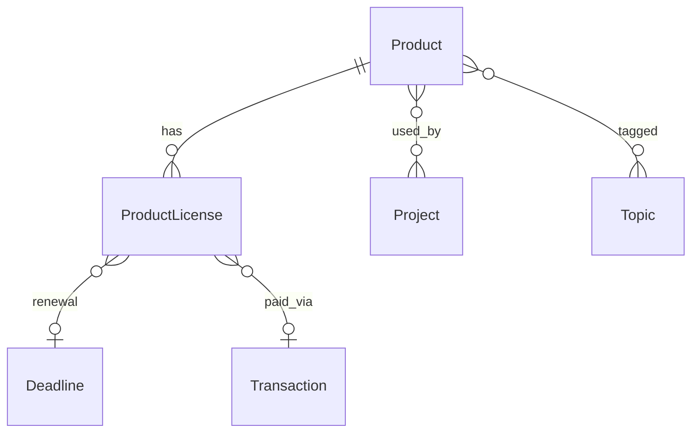

# Products module

**Purpose:** Track **commercial products and assets the organization buys or licenses** — not software projects you build.

Examples: Creative Tim template packs, Cursor IDE, JetBrains licenses, Figma, cloud SaaS seats, stock asset libraries, paid npm/UI kits, domain registrations where treated as a product line.

**Contrast:** **[Projects](projects_module.md)** are containers for work you deliver (plans, systems, architecture, tasks). A project may **use** several products; a product may be **used by** several projects.

**Source:** Clarified in [operational_project_plan.md](operational_project_plan.md) §10.11; [operational_use_cases_vs_apps.md](operational_use_cases_vs_apps.md).

---

## Definitions

| Term | Meaning |
|------|---------|
| **Product** | A identifiable offering from a vendor: “Cursor Pro”, “Creative Tim Material Dashboard Pro”, “AWS account (billing product)”. |
| **License / subscription** | How you hold the right to use it: seats, term, renewal, cost. One product can have multiple active licenses (e.g. team + personal). |
| **Vendor** | Supplier (Creative Tim, Anysphere, JetBrains). Optional FK or text on Product. |

Products do **not** own plans, milestones, systems, or architecture profiles. They may link to **Deadlines** (renewal), **Money** (purchase/renewal transactions), and **Topics**.

---

## Feature set (MVP → later)

### MVP

- **Product registry:** name, slug, vendor, `product_kind` (saas, template_pack, ide, design_tool, cloud_service, asset_library, other), description, homepage/docs URLs.
- **ProductLicense** (or **ProductSubscription**): FK Product; `license_type` (perpetual, subscription, trial, seat_based, usage_based, open_source); seats (optional); `started_at`, `ends_at`, `renewal_interval` (monthly/yearly/none); `status` (active, expired, cancelled, trial); optional cost and currency; masked **license_key** or reference to **Part** for secrets.
- **Project ↔ Product:** M2M “this project uses these licensed products” with optional role note (e.g. “design system source”).
- **Renewals:** link **Deadline** (renewal type) and optional **Transaction** in Money.
- **List/filters:** by vendor, kind, status, expiring soon.

### Later

- Attachments (invoice PDF via documents app), usage notes, owner/contact per license.
- Link to **Knowledge** articles (how we use this product).
- Dashboard widget: licenses expiring this month.

---

## Data model (conceptual)

---

## App placement

- **App:** `apps.products` (tenant schema, `TENANT_APPS`).
- **Repurpose:** Existing `Product` model today wrongly mixes project lifecycle (`status` live/dev/testing). Implementation should **move lifecycle fields to `Project`** and reshape `Product` for commercial catalog + licenses (see project management features plan in `.cursor/plans/`).

---

## Out of scope

- Built software you develop → **Project**, **System**, **Architecture**.
- Platform integration credentials (Stripe API for your app) → **Services** / **Integrations** / **Part** on Project/System.
- Inventory of physical goods (unless you later add a separate module).

---

## Links to dev

When implementing: `docs/dev/products_models.md` (ER, migrations, encryption for license keys).
