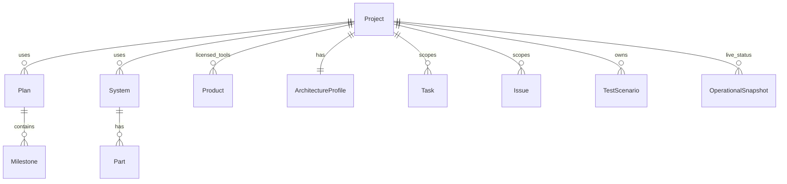

# Projects module

**Purpose:** **Project management hub** — containers for work the organization builds and operates: linked plans, milestones, systems, parts, architecture, integrations, tasks, issues, tests, and knowledge.

Examples: “Operational web app”, “Client portal v2”, “Internal billing service”.

**Contrast:** **[Products](products_module.md)** are things you **buy or license** (Cursor, template packs). Projects **use** products; they **are made of** plans, systems, and infrastructure.

**Source:** [operational_project_plan.md](operational_project_plan.md) §10.11 (Projects); [operational_use_cases_vs_apps.md](operational_use_cases_vs_apps.md) use case 1.

---

## Definitions

| Term | Meaning |
|------|---------|
| **Project** | A deliverable or initiative with lifecycle status (idea → dev → testing → live → archived), owner, and composition relations. |
| **Composition** | Plans, systems, parts/keys, architecture profile, stack technologies, integrations scoped to this project. |
| **Live status** | Operational health snapshots over time (separate from lifecycle status). |

---

## Feature set

Aligned with the project management features plan (`.cursor/plans/project_management_features_10041c5f.plan.md`):

- **Project CRUD:** name, slug, description, `status` (idea/dev/testing/live/archived), owner, topics.
- **Relations:** M2M Plan; M2M System; optional M2M Milestone; M2M licensed **Product** (tools used); Integration instances scoped to project.
- **Parts & keys:** GFK parent **Project** or **System** (ApiKey, Credential, Part).
- **Architecture:** `ArchitectureProfile` per project (environments, components, connections).
- **Stack:** TechnologyUsage on Project.
- **Work tracking:** Task, Issue, TestScenario/TestRun scoped by project FK.
- **Operations:** OperationalSnapshot; optional PlannedCheck.
- **Knowledge:** Articles and Solutions linked to project.
- **Dashboard:** Project summary widget (status, open issues, failing tests, expiring keys).

---

## Data model (conceptual)

---

## App placement

- **App:** `apps.projects` — **activate** in `TENANT_APPS` (currently empty and not installed).
- **Model:** `Project` (new). Do not use `apps.products.Product` as the project entity.
- **Migration path:** If `products_product` rows exist with project semantics, data migration to `projects_project` before reshaping Product for commercial licenses.

---

## Links to dev

When implementing: `docs/dev/projects_models.md`; update [architecture_scaffold.md](../dev/architecture_scaffold.md).
